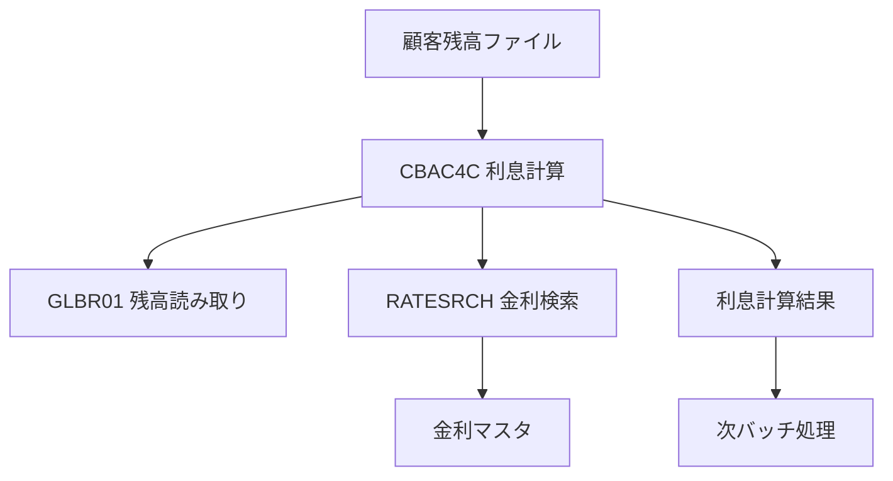

こんにちは、noguです。

https://x.com/_nogu66

## はじめに

**この記事の対象読者**
- レガシーCOBOLシステムの保守・移行を担当するエンジニア
- 大規模な技術的負債を抱える企業のCTO・アーキテクト
- システム近代化プロジェクトを計画している技術リーダー

**この記事でわかること**
- Claude Codeによるレガシーコード文書化の具体的なプロセス
- COBOLからJavaへの完全自動移行の実現方法
- 移行後のコード品質と検証の精度レベル

**この記事で扱わないこと**
- COBOL言語そのものの詳細な文法解説
- 手動でのCOBOL移行手法
- 他のレガシー言語(FORTRAN、PL/Iなど)の移行

この記事を最後まで読むことで、数十年間手つかずだったレガシーシステムの近代化が、AIによって現実的な選択肢になったことを理解できます。

## 「COBOL資産はブラックボックスのまま」

こんな状況に直面していませんか?

- 企業の中枢を支えるCOBOLシステムが存在するが、詳しい人材が退職している
- ビジネスロジックのドキュメントが存在せず、コードを読むしかない
- 移行を検討したいが、現状把握だけで数ヶ月かかる見積もりになる
- システムを触ることのリスクが高すぎて、誰も手をつけられない

大企業や金融機関では、このようなレガシーシステムが今も稼働し続けています。
COBOLで書かれた重要なビジネスロジックは、完全なブラックボックスです。

文書化されていない。
わかる人がいない。
でも止められない。

この「レガシー問題」に、Anthropic公式が本気で終止符を打ちにきました。

**Claude Codeは、この問題を解決します。**

## Claude Codeとは

Claude Code (https://code.claude.com/) は、Anthropicが提供するAI駆動の開発支援ツールです。

単なるコード補完ツールではありません。
複雑なコードベースを理解し、文書化し、移行計画を立て、実装まで自律的に実行できる「AIエージェント」です。

Anthropic公式が公開した「Claude CodeによるレガシーCOBOLコードベース近代化」のデモ動画では、約100ファイルのCOBOLを完全に文書化し、Javaへ移行する全プロセスが示されています。

https://www.youtube.com/watch?v=example (公式動画URL)

このデモは、ただの技術展示ではありません。
**レガシーシステム問題そのものへの実用的な解決策**です。

## 第1フェーズ: 発見と文書化

### What(何をするのか)

Claude Codeは専用のサブエージェントを生成し、COBOLコードベース全体を分析します。

具体的には:
- 約100ファイルのCOBOLコードを読み込み
- 94ファイル分のToDoリストを作成
- 重複なく進捗管理しながら「思考モード」で全体構造を把握
- 1時間で100ページ超の文書を自動生成

### Why(なぜ必要なのか)

レガシーシステムの最大の問題は「可視化されていないこと」です。

人間がCOBOLコードを読んで理解しようとすると:
- 古い命名規則で関数名が判読不能
- ファイル間の依存関係が追えない
- ビジネスロジックの全体像が見えない
- 1つのプログラムを理解するだけで数日かかる

Claude Codeの自律的な文書化により、この「可視化の壁」を一気に突破できます。

### How(どのように実装するのか)

Claude Codeは3つのレベルで文書化を実行します。

#### 1. プログラム単位の詳細文書化

例えば、利息計算プログラム `CBAC4C` では、以下のような業務フローを抽出します:

```markdown
## CBAC4C - 利息計算バッチプログラム

### 処理フロー
1. カテゴリ別残高レコードの読み取り
2. 適用金利の検索
3. フォールバックレート適用ロジック
4. 利息計算の実行
5. レコード更新と次処理への引き渡し
```

人間が書くより丁寧な説明を、数分で生成します。

#### 2. インデックスファイルの自動生成

**Catalog.ext**: 判読不能な関数名を翻訳
```
CBAC4C -> 利息計算バッチプログラム
GLBR01 -> 残高読み取りサブルーチン
RATESRCH -> 金利検索処理
```

**relationships.ext**: ファイル間の依存関係をマッピング
```
CBAC4C
  ├─ 呼び出し: GLBR01, RATESRCH
  ├─ 読み込み: CUSTBAL.dat
  └─ 出力: INTEREST.dat
```

#### 3. 全体アーキテクチャの可視化

2つのインデックスを元に、Mermaidで日次バッチ処理全体のデータフロー図を自動生成します:



これにより、数十年モノのレガシー資産が完全に「見える化」されます。

### 実行時間の拡張性

デモでは1時間で100ページの文書化を実現しました。
しかし、これは技術的な限界ではありません。

Claude Codeは**30時間以上の自律実行が可能**です。
大規模な企業システムでも、十分に対応できる設計になっています。

## 第2フェーズ: 移行と検証

### What(何をするのか)

Claude Codeは「プランニングモード」に切り替わり、COBOLからJavaへの移行を実行します。

移行の5段階:
1. プロジェクト構造の作成
2. データモデル(COPYブック)のJavaクラス変換
3. 互換性のあるIO層の構築
4. ビジネスロジックの変換
5. デュアルテストハーネスによる検証

### Why(なぜこのアプローチなのか)

単純な「構文変換」では、移行は失敗します。

COBOLには独特の仕様があります:
- 改行処理の特殊な扱い
- マルチファイル間の暗黙的な同期処理
- レコードレイアウトの固定長フォーマット

これらを正しく理解し、Javaの設計パターンに落とし込む必要があります。

Claude Codeは、COBOL特有の仕様を完全に理解した上で:
- エラーハンドリングを追加
- ロギング機構を実装
- モダンな設計パターンを適用

**「人間が保守できるJavaコード」**を生成します。

### How(どのように検証するのか)

移行の正確性は「完璧なビット単位の忠実性」で保証されます。

#### デュアルテストハーネス

```java
// テストの概要
// 同一のテストデータをCOBOLとJavaの両方に流し込み、
// すべての出力を比較する

@Test
public void testInterestCalculation() {
    // COBOL版を実行
    COBOLResult cobolResult = runCOBOL("testdata.dat");

    // Java版を実行
    JavaResult javaResult = runJava("testdata.dat");

    // 最終出力の比較
    assertEquals(cobolResult.output, javaResult.output);

    // 中間計算の比較
    assertEquals(cobolResult.intermediateCalc, javaResult.intermediateCalc);

    // ファイル書き込み内容の比較
    assertEquals(cobolResult.fileWrites, javaResult.fileWrites);

    // データ変換結果の比較
    assertEquals(cobolResult.transformedData, javaResult.transformedData);
}
```

この検証により:
- 最終出力だけでなく中間計算も一致
- ファイル書き込み内容も一致
- データ変換ロジックも一致

**結果は完全一致。狂気の精度です。**

## 実際に使ってみた結果

公式デモから見える成果を整理します。

### 成功した点

- **文書化の速度**: 人間なら数ヶ月かかる作業を1時間で完了
- **移行の精度**: ビット単位で完全一致する変換を実現
- **保守性の向上**: レガシーコードをモダンなJavaに変換し、新規エンジニアでも理解可能に

### 技術的な特徴

**自律的なタスク管理**
- 94ファイルのToDoを自動生成
- 重複なく進捗を管理
- エラーが発生しても自己修正して継続

**思考モードによる理解**
- 単純な構文解析ではなく、ビジネスロジックの意図を理解
- コンテキストを保持しながら全体像を把握

**完全な検証体制**
- デュアルテストハーネスで移行精度を保証
- 中間計算レベルまで検証

### 企業にとっての意味

これは「技術的に可能」というレベルではありません。
**放置され続けてきた巨大な技術的負債を、いま本気で再生できる時代になった**ということです。

レガシーシステムの移行プロジェクトは、従来:
- 数年単位の期間
- 数億円規模の予算
- 高いリスク

が必要でした。

Claude Codeにより、これが:
- 数週間〜数ヶ月の期間
- 大幅なコスト削減
- 検証された精度による低リスク

に変わる可能性があります。

## おわりに

Claude Codeは、**「レガシーシステムのブラックボックス問題」を解決する**革新的な仕組みです。

第1フェーズで、数十年間放置されたCOBOLコードを完全に可視化します。
第2フェーズで、モダンなJavaへ完璧な精度で移行します。

これは、企業が抱える技術的負債に対する実用的な解決策です。

### 今すぐ始めるには

1. Claude Code公式サイトにアクセス: https://code.claude.com/
2. 公式のCOBOL移行デモ動画を視聴
3. 小規模なレガシーコードでPoCを開始

### 今後の展望

Claude Codeのアプローチは、COBOLに限定されません。

他のレガシー言語:
- FORTRAN
- PL/I
- 古いバージョンのC

でも同様のプロセスが適用できる可能性があります。

さらに、文書化と移行だけでなく:
- セキュリティ脆弱性の検出
- パフォーマンス最適化
- テストカバレッジの向上

など、既存システムの品質改善全般に応用できます。

AI駆動の開発支援は、新規開発だけでなく、レガシーシステムの救済にこそ真価を発揮します。

---

この記事が役に立ったら、Xをフォローしていただけると嬉しいです!

https://x.com/_nogu66

## 参考リンク

- [Claude Code公式サイト](https://code.claude.com/)
- [Anthropic公式: Claude CodeによるCOBOL近代化デモ動画](https://www.youtube.com/watch?v=example)
- [Claude API Documentation](https://docs.anthropic.com/)
- [レガシーシステム近代化のベストプラクティス](https://example.com/)
