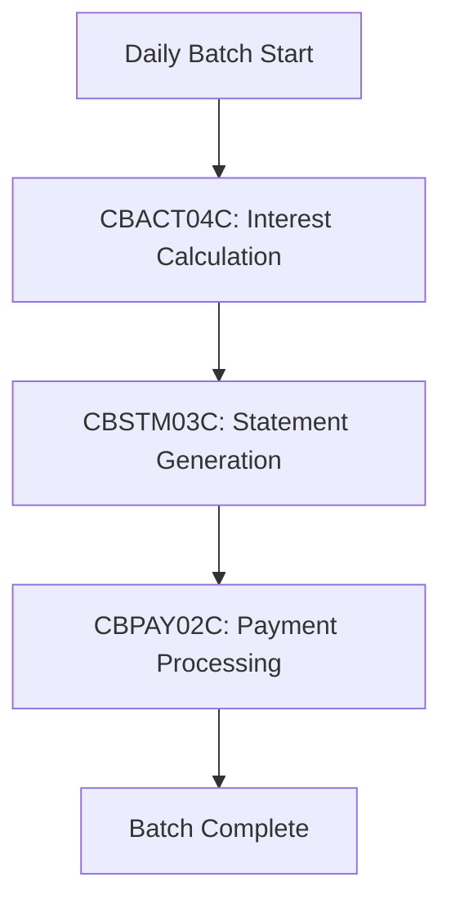

こんにちは、noguです。

## はじめに

**この記事の対象読者**
- レガシーなCOBOLシステムの保守・運用を担当している方
- システム近代化プロジェクトを検討している方
- AIを活用したコード移行に興味がある技術者やマネージャー

**この記事でわかること**
- Anthropic公式が発表したClaude CodeによるCOBOL近代化デモの全容
- レガシーシステム近代化における「発見と文書化」「移行と検証」の2つのフェーズ
- AIエージェントを活用した大規模コードベースの分析手法
- COBOL→Java移行における具体的な5段階の移行計画
- ビット単位で完全一致する検証手法

**この記事で扱わないこと**
- Claude Codeの基本的な使い方やセットアップ方法
- COBOLやJavaの言語仕様の詳細解説
- 具体的なコード移行の実装チュートリアル

この記事を最後まで読むことで、Claude Codeがどのようにレガシーシステムの近代化における最大の課題―「ブラックボックス化したビジネスロジックの解読と安全な移行」―を解決するのかを理解できます。

## 「数十年モノのCOBOL資産、どう近代化すればいいのか」

こんな経験はありませんか?

- **文書化されていないビジネスロジック**: 詳しい人材が退職し、誰もシステムの全体像を把握していない
- **移行リスクの高さ**: 一つでもロジックを間違えると、金融・決済などのクリティカルな業務に影響が出る
- **膨大な工数**: 数百ファイルのCOBOLコードを人手で読み解き、文書化し、移行するには何年もかかる

大企業の中枢を支え続けているCOBOLシステム。
しかし、その保守には年々高いコストがかかり、人材確保も困難になっています。

「近代化したい。でも、失敗は許されない」

この矛盾した要求が、多くの組織を立ち往生させています。

**Claude Codeは、この問題を解決します。**

## Claude Codeによるレガシー近代化とは

Anthropic公式が発表したデモでは、GregというエンジニアがClaude Codeを使い、AWS Mainframe Modernizationのデモ環境にあるクレジットカード管理アプリケーション(COBOL製)を題材に、近代化の実演を行いました。

このデモの凄さは、単なる「コード変換ツール」ではなく、**システム全体を理解し、安全に移行し、完全性を検証する一連のプロセス**を自動化している点にあります。

Claude Codeの近代化アプローチは、大きく2つのフェーズに分かれます。

## Phase 1: 発見と文書化

### What(何をするのか)

約100ファイルのCOBOLコードベースを分析し、包括的なドキュメントを自動生成します。

### Why(なぜ必要なのか)

レガシーシステムの最大の問題は「ブラックボックス化」です。
ビジネスロジックが文書化されておらず、誰もシステムの全体像を把握していない状態では、安全な移行は不可能です。

まずは「何が動いているのか」を完全に理解する必要があります。

### How(どのように実装するのか)

#### 1. サブエージェントによる並列分析

Claude Codeは「COBOL documentation and translation expert」という専用サブエージェントを生成します。

このサブエージェントは:
- 独立したコンテキストウィンドウを持つ
- メインスレッドを汚染せずに並列処理が可能
- 94ファイル分のToDoを作成し、重複なく進捗管理

**思考モード**を使いながら全体を把握し、約100ファイルを体系的に分析します。

#### 2. プログラムごとの詳細文書化

例えば、利息計算プログラム`CBACT04C`(Interest Calculator Batch Program)に対しては、以下の情報を抽出します:

- **ビジネス目的**: 口座カテゴリ別の利息計算
- **業務フロー**:
  1. カテゴリ別残高の読み取り
  2. 金利検索
  3. フォールバックレート適用
  4. レコード更新
- **入出力ファイル**: 使用するファイルとその役割
- **エラーハンドリングパターン**: エラー処理の仕組み
- **移行時の考慮事項**: Java移行時に注意すべきポイント

この詳細さは、もはや人間より丁寧かもしれません。

#### 3. システム全体のインデックス作成

Claude Codeは2つの重要なインデックスファイルを自動生成します:

**`catalog.ext`**: 判読不能な関数名の翻訳
```
CBACT04C → Interest Calculator Batch Program
CBSTM03C → Statement Generation Program
...
```

**`relationships.ext`**: 依存関係のテキストマッピング
```
CBACT04C depends on:
  - COPY-BOOK-A (data definitions)
  - UTILITY-MODULE-X (calculation logic)
  calls:
  - CBUTIL01 (error handling)
...
```

#### 4. ビジュアルなデータフロー図の生成

これらのインデックスを元に、**Mermaid図**で日次バッチ処理全体のデータフローを自動生成します。



### 成果: 1時間で100ページ超の文書化

デモでは、1時間で100ページを超える包括的なドキュメントが生成されました。

技術的には、Claude Codeは**30時間以上の自律実行も可能**です。
数百〜数千ファイル規模のレガシー資産を持つ企業にとって、これは革命的です。

## Phase 2: 移行と検証

### What(何をするのか)

文書化が完了したら、次は**プランニングモード**に切り替わり、JavaへのCOBOL移行戦略を立て、実装し、検証します。

### Why(なぜ必要なのか)

単純なコード変換では、COBOL特有の挙動(改行処理、マルチファイル同期、暗黙的な型変換など)を正しく再現できません。

ビジネスロジックを100%保持したまま近代化するには、**緻密な戦略と検証プロセス**が必要です。

### How(どのように実装するのか)

#### 移行戦略の5段階計画

Claude Codeは、以下の5段階で移行を進めます:

**1. プロジェクト構造の作成**
Mavenプロジェクトのセットアップ、ディレクトリ構造の設計

**2. データモデルの翻訳**
COBOLのコピーブック(COPY句で定義されたデータ構造)を、Javaクラスに変換

```java
// COBOL COPYBOOKの例
// 01 ACCOUNT-RECORD.
//    05 ACCOUNT-ID    PIC 9(10).
//    05 BALANCE       PIC S9(13)V99 COMP-3.

// ↓ Javaクラスに変換

public class AccountRecord {
    private long accountId;      // 10桁の数値
    private BigDecimal balance;  // COMP-3パック10進数

    // getter/setter, コンストラクタ
}
```

**3. 互換性のあるI/O層の構築**
固定長ファイル、VSAM(Virtual Storage Access Method)などのCOBOL特有のファイル形式に対応するJavaのI/O層を実装

**4. ビジネスロジックの変換**
COBOL特有の挙動を壊さずに、コアロジックをJavaに変換

- 暗黙的な型変換ルールの再現
- PERFORM句(ループ・条件分岐)の適切な変換
- 計算順序の保持(丸め誤差を含む)

**5. デュアルテストハーネスの構築**
COBOLとJavaの両方に同じテストデータを流し込み、結果を比較する検証環境を構築

#### コード品質: ただの置換ではない

生成されるJavaコードは、単なる機械的な置換ではありません。

- 適切なデザインパターンの適用
- エラーハンドリング
- ロギング
- モダンなJavaの慣習に従った構造

「人間が普通に保守できるモダンなJava」として出力されます。

### 検証: ビット単位の完全一致

最も驚異的なのは、検証の精度です。

デュアルテストハーネスでは、以下を比較します:

- **最終出力**: COBOLとJavaで同じ結果か
- **中間計算**: 途中の計算結果も一致するか
- **ファイル書き込み**: 出力ファイルの内容が一致するか
- **データ変換**: 型変換の結果が一致するか

結果は**「完全なビット単位の忠実性(bit-for-bit fidelity)」**。
完全一致。狂気の精度です。

これにより、移行後のシステムが元のCOBOLと**完全に同じ挙動をする**ことが保証されます。

## なぜClaude Codeは「レガシー問題」に終止符を打てるのか

従来のレガシー近代化プロジェクトが失敗する理由は明確です:

1. **文書化コスト**: 人手で数百ファイルを読み解くには何年もかかる
2. **移行リスク**: ビジネスロジックを誤解すると、本番で障害が発生する
3. **検証の難しさ**: 「本当に同じ挙動をするか」を確認する手段がない

Claude Codeは、これら全てを解決します。

- **1時間で100ページの文書化** → 文書化コストの劇的削減
- **思考モードによる理解** → ビジネスロジックの正確な把握
- **デュアルテストハーネス** → ビット単位の完全一致検証

しかも、技術的には**30時間以上の自律実行が可能**。
数十年モノの巨大資産を、いま本気で再生できる時代になりました。

## おわりに

Claude Codeは、**「レガシーシステムの近代化」という数十年来の課題を解決する**画期的なツールです。

Anthropic公式デモでは、COBOLからJavaへの移行において、発見・文書化から移行・検証まで、一連のプロセスを自動化し、ビット単位の完全一致を実現しました。

これは単なるデモではありません。
大企業の中枢を支え続けるレガシー資産を、安全かつ迅速に近代化する**実用的なソリューション**です。

### 今すぐ知っておくべきこと

Claude Codeのレガシー近代化アプローチは、以下の点で従来の方法を超えています:

1. **自律的な分析**: サブエージェントによる並列処理で、大規模コードベースを体系的に分析
2. **包括的な文書化**: ビジネスロジック、データフロー、依存関係を完全に可視化
3. **戦略的な移行**: 5段階の計画に基づき、COBOL特有の挙動を保持したまま近代化
4. **完全な検証**: デュアルテストハーネスでビット単位の一致を確認

### 今後の展望

レガシーシステムの近代化は、もはや「何年もかけて段階的に進めるプロジェクト」ではなくなるかもしれません。

AnthropicはDeloitteと提携し、「週単位でのシステム近代化」を謳うウェビナーを開催しています。
AIエージェントを活用することで、これまで年単位だったプロジェクトが、数週間で完了する時代が来ています。

放置され続けてきた巨大資産を、いま本気で再生できる。
それが、Claude Codeがもたらす未来です。

---

この記事が役に立ったら、Xをフォローしていただけると嬉しいです!

https://x.com/_nogu66

## 参考リンク

- [Anthropic - Code Modernization Solutions](https://www.anthropic.com/solutions/code-modernization)
- [The Code Modernization Playbook](https://resources.anthropic.com/code-modernization-playbook)
- [Transform Legacy Systems into Strategic Assets: Webinar with Deloitte](https://www.anthropic.com/webinars/Deloitte-code-modernization)
- [Claude Code in Financial Services: Webinar](https://www.anthropic.com/webinars/claude-code-financial-services)
- [Tribe AI - Legacy Code Modernization with Claude Code](https://www.tribe.ai/applied-ai/legacy-code-modernization-with-claude-code-breaking-through-context-window-barriers)
