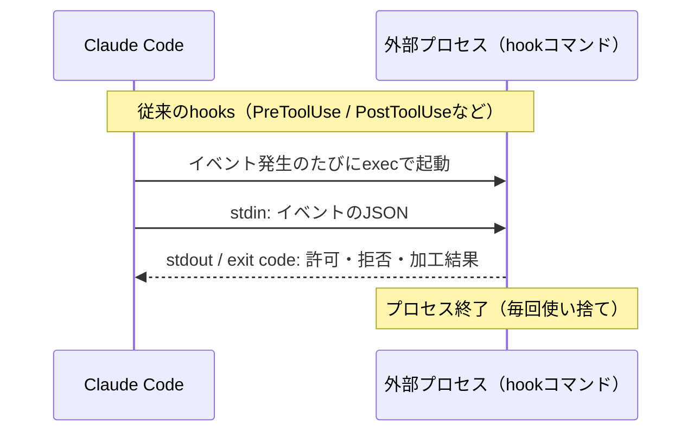
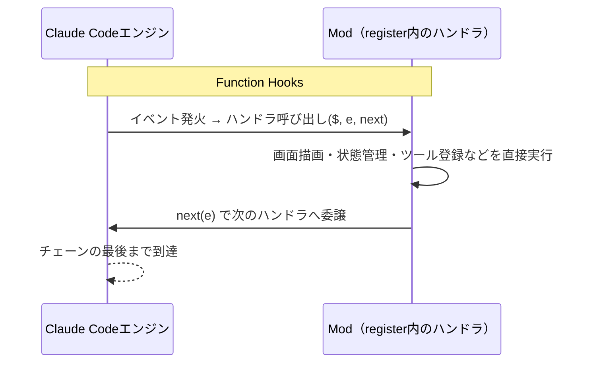

:::message
本記事は [Claude Code Issue #91870](https://github.com/anthropics/claude-code/issues/91870) で議論中の暫定仕様（2026年9月19日時点）をもとにしています。APIは今後変更される可能性があるため、最新情報は公式サイトを参照してください。
:::

noguです。

先日、Claude Codeに**Claude Mods**という機能が公開されました。

これは、TypeScriptの関数を用いて、Claude Codeの機能や見た目を自由かつ安全にカスタマイズできる拡張機能の仕組みです。個人的に、この機能は**かなり将来性の高い機能**だと感じています。

本記事では、Claude Modsの機能について深掘りするとともに、どのように活用していくことができるのかまとめていきます。

https://x.com/bcherny/status/2099551291601248485?s=20

## Claude Modsとは

Claude Mods（以下、Mod）とは、Claude Codeの機能や見た目をカスタマイズできる、プラグインの仕組みです。

これまでもClaude Codeには「Hooks」という拡張の仕組みがあり、ツール実行の前後などのタイミングで、自分で用意したコマンドを実行できました。Modはその発展形です。

コマンドではなくTypeScriptの関数として書き、Claude Code本体に直接組み込みます。**そのため、コマンドを叩くだけでは届かなかった画面表示の変更やツールの追加まで、踏み込んで手を加えられます**（この仕組み自体は「Function Hooks」と呼ばれていて、詳しくは次章で説明します）。

```bash
example-mod/
├── .claude-plugin/
│   └── plugin.json      # プラグインのメタ情報
├── hooks/
│   ├── hooks.json       # どのモジュールをフックとして使うか宣言
│   └── register.ts または register.tsx      # register(on, options) の実体
└── types/
    └── claude-code.d.ts # /plugin-types が生成する型定義
```

Modは、外付けの拡張機能ではありません。Claude Code自身に標準搭載されている[`/diff`コマンド](https://github.com/anthropics/claude-code/tree/main/mods/diff)やテレメトリ機能も、Modとして実装されています。さらに、Claude Code 2.1.277で追加された`AGENTS.md`のサポートも、[`agents-md`](https://github.com/anthropics/claude-code/tree/main/mods/agents-md)というModとして提供されています。**つまり、Claude Modsは、Claude Codeの標準機能自体を拡張できるということです。**

https://x.com/trq212/status/2101009393731223817?s=20

公式のmodsフォルダには、現時点で4つのModが用意されています。興味がある方はこちらをご覧ください。

https://github.com/anthropics/claude-code/tree/main/mods

## Modを使うための準備

Function Hooksは、現時点ではearly access機能です。使うには、環境変数`CLAUDE_CODE_ENABLE_FUNCTION_HOOKS`を`1`にして、明示的に有効化する必要があります。

`~/.claude/settings.json`の`env`に、次のように設定します。

```json:~/.claude/settings.json
{
  "env": {
    "CLAUDE_CODE_ENABLE_FUNCTION_HOOKS": "1"
  }
}
```

有効にしたら、`--plugin-dir`でModのフォルダを指定して起動します。インストールせずに、そのセッションだけで試せます。

```bash
claude --plugin-dir ./my-mod
```

Modのエントリポイントは、`hooks/hooks.json`の`modules`で指定します。

```json:hooks/hooks.json
{
  "modules": ["./register.ts"]
}
```

保存すると実行中のセッションにホットリロードされるため、Claude自身にModを書かせながら試すこともできます。

## Function Hooksとは

前章でも説明した通り、Function Hooks（関数フック）とは、Modの基盤となるClaude Codeのハーネス（プログラム）自体を差し替えるようなフックです。

従来のhooksは、対象イベントが起きるたびにClaude Codeが外部プロセスを起動し、標準入力にイベントのJSONを渡します。それを、標準出力や`exit code`で許可・拒否・加工結果を受け取る仕組みでした。

**プロセスをまたぐため、やり取りできるのはテキストの入出力と可否判定までです**。



**一方、Function Hooksは、TypeScriptの関数としてClaude Codeを動作させるエンジンプロセスに直接ロードされます。**

`register(on, options)`という関数の中で、`on(イベント名, ハンドラ)`という形でイベントごとの処理を登録します。

ハンドラは`($, e, next)`という3つの引数を受け取る関数で、`$`がエンジンの操作窓口、`e`がそのイベントの入力データ、`next`が次のハンドラへ処理を渡す関数です。プロセスを挟まず同じメモリ空間で呼ばれるので、`$`を通じて画面描画・状態管理・ツール登録まで直接コントロールすることができます。

この`(e, next)`という形（`$`はエンジン固有のユーティリティだと考えてください）は、Express、Koaの**ミドルウェアパターン**そのものです。`next()`を呼べば次のハンドラに処理を委ね、呼ばなければそこで処理を止められます。



両者を図にすると、違いは「プロセスをまたぐかどうか」に集約されます。

## Claude Modsの基本形

### register(on, options) と ($, e, next)

前章で記載の通り、Modの核となるのは、次のコードです。

```ts
export function register(on) {
  on("イベント名", { /* マッチャー（省略可） */ }, async ($, e, next) => {
    /* ここに処理を書く */
  })
}
```

`register`の中で`on`を呼び、「どのイベントに」「どんな処理をつなぐか」を登録します。第2引数の**マッチャー**は、イベントの絞り込み条件です。たとえば`{ tool: "Bash" }`と書けば、Bashの`tool.call`だけを拾えます。マッチャーは省略できます。

`on`に渡すハンドラは、常に次の3つの引数を受け取ります。

| 引数 | 役割 |
|---|---|
| `$` | エンジンとの唯一の接続窓口。画面描画・モデル・ストレージ・タイマー・ツール登録など、外の世界に触れる手段はすべて`$`経由。`$`のメソッドは、それ自体がイベントでもある |
| `e` | そのイベントの入力データ。フラットな値で、idは固定（pinned）、それ以外のペイロードは自由に書き換えてよい |
| `next` | 次の処理へ進む関数 |

Modは隔離環境で動くため、`$`を使わない限り、外の世界には何もできません。これが安全性の要です。

具体例として、公式チートシートの「THE HOOK」を見てみましょう。`tool.call`で`rm -rf /`を拒否し、結果を加工して返す、基本形のすべてが入っています。

```ts
export function register(on) {
  on("tool.call", { tool: "Bash" }, async ($, e, next) => {
    if (e.command.includes("rm -rf /")) return { deny: "no" }
    const r = await next(e)               // 自分より内側の全フック→core
    return { ...r, text: redact(r.text) } // 上りで結果を加工
  })
  .catch(($, e, next) =>                  // 例外 or タイムアウト時
    next.called ? next(e) : { deny: next.error.kind })
}
```

:::message
`redact`は、機密情報をマスクする自前の関数のつもりで置かれています。
:::

- `{ tool: "Bash" }`のマッチャーで、Bashの`tool.call`だけを拾います
- `e.command`から、呼ばれようとしているコマンドを読み取れます
- 危険だと判断したら`{ deny: "no" }`を**返して**拒否します。`deny`は`$`のメソッドではなく戻り値です。このとき`next(e)`を呼んでいないので、後続のハンドラには処理が渡りません
- 問題がなければ`await next(e)`で、自分より内側のすべてのフックと、最終的にClaude Code本体（core）の処理を実行し、その結果を受け取ります
- `{ ...r, text: redact(r.text) }`のように、結果を加工してから返せます
- `.catch`は、ハンドラが例外を投げたり、タイムアウトしたときの後始末です。`next.called`で、すでに`next`を呼んだかどうかを判定できます

**すべてのイベント、APIリファレンスは末尾のAppendixに記載しています。**

### next() はミドルウェア

`next()`は、呼ぶタイミングと戻り値の扱い方次第で、「**前処理**」「**後処理**」「**早期リターン**」のどれにでもなることができます。

**早期リターン**

先ほどの`rm -rf /`の例のように、`next(e)`を呼ばずに`return`すれば、そこで処理チェーンは止まります。coreの代わりに自分が答える形になり、`tool.call`なら`{ deny }`か、独自の結果を返せます。危険な操作の遮断や、権限のない操作の拒否に使うパターンです。

**後処理**

```ts
on('tool.call', async ($, e, next) => {
  const start = Date.now()
  const r = await next(e) // 先に後続のハンドラ→core（実際のツール実行）を走らせる
  $.ui.log(`${e.tool}: ${Date.now() - start}ms`) // 実行後に、トランスクリプトへ1行出す
  return r
})
```

`next(e)`の結果を先に受け取ってから、計測やログ出力などの後処理を差し込めます。Koaの「オニオンモデル」と同じ発想です。

**結果を書き換えて返す**

```ts
on('tool.call', { tool: 'Read' }, async ($, e, next) => {
  const r = await next(e)
  return { ...r, text: r.text.replace(/sk-[a-zA-Z0-9]+/g, '[REDACTED]') }
})
```

後続の処理が返した結果をそのまま返さず、加工してから返すこともできます。**ここでは`Read`ツールの出力に混じったAPIキーらしき文字列をマスクしています。**

### next のその他の機能

`next`には、呼び出す以外にも、次のような機能があります。

| 式 | 説明 |
|---|---|
| `next(e)` | 自分より内側の全フック→coreを実行し、結果を返す |
| `next`を呼ばずにreturn | coreの代わりに自分で答える。`tool.call`なら`{ deny }`、または独自の結果 |
| `next.trace` | await後に参照する。内側の各リンクのplugin / tier / e / result / outcome |
| `next.origin` | 呼び出し元の`{ plugin, tier }`。エンジンが投げた場合は`{ engine, core }` |
| `next.event` | globや`*`のフック内で、実際にディスパッチされたイベント名 |
| `next.is("tool.*", e)` | 型述語。`e`（と結果）を、マッチするイベントに絞り込む |
| `next.to(e, "builtin")` | managed限定。より下位のtierで継続する（絞り込みのみ可） |
| `next(e); next(e)` | 0回以上呼べる。呼ぶたびに、内側で新しいディスパッチが発生する |
| `next.error` / `next.called` | `.catch`内で使う。`{ kind, message, budget }`と、すでにディスパッチしたかどうか。`next(e)`で再実行できる |

`.catch`は、ハンドラが例外を投げたり、10秒を超えたときのための宣言です。宣言していなければ、そのハンドラは1行の薄い表示とともにスキップされます。宣言していれば、猶予予算の中で、`next`と同等の権限で代わりに答えられます。

## 5層のチェーン構造と権限

Function Hooksは、1つのイベントに複数のModが同時にフックしても安全に積み重なるよう、次の5層のチェーンとして実行されます。coreに近づくほど権威は弱くなります。

| 階層 | 内容 |
|---|---|
| prepend | 組織ポリシー |
| user | 自分がインストールしたもの |
| append | 組織ポリシー |
| builtin | バイナリ同梱 |
| core | エンジン本体 |

1つのイベントは、この5層を貫通する1本の「**fold**」（関数型用語のinject/reduceに由来する、元提案者の表現）として流れます。

- **下り**：`e`（入力データ）は各層を通過するたびに加工されうる。製品（core）に届く直前が`append`
- **core**：Claude Codeのエンジン本体がデフォルトの処理を行う
- **上り**：結果は各層を戻るたびに加工されうる。エンジンに実行される直前が`prepend`

組織はこのチェーンの両端、つまり`prepend`と`append`を押さえています。真ん中にいる`user`（自分がインストールしたMod）は、この2つに挟まれる形です。

たとえば`user`のModがあるツール呼び出しを許可しても、外側の`append`にいる組織のModが後からそれを拒否できます。逆に`prepend`の組織ポリシーが先に拒否すれば、そもそも`user`のModにはイベントが届きません。個人のModが組織のルールを一方的に上書きできないよう、外側を組織で挟んでいるわけです。

何もフックを足さなければ、実質的には次の1行と同じ意味になります。

```javascript
on("*", ($, e, next) => next.to(e, "builtin"))
```

「すべてのイベント（`*`）を受け取ったら、`user`や`append`の層では何もせず、次の層である`builtin`にそのまま渡す（`next.to(e, "builtin")`）」という宣言です。

**つまり「出荷時のまま」の状態を1行で表しています。ここに自分のハンドラを足していくのがModを書くということです。**

具体例として、Claude Codeが公式に提供する`sec-default`は、組織側がこの構造を使ってあらかじめ用意した防御用のModです。

https://github.com/anthropics/claude-code/tree/main/mods/sec-default

managedな端末、またはTeam/Enterpriseプランの場合、`sec-default`は自動的に最も外側の`prepend`に座ります。その結果、個人がインストールしたプラグインからは、次のものに触れられなくなります。


- 組織の従来hooks
- プロンプトのシステムセクション
- 組織の設定
- 組織提供ツールの説明文

なお、組織が`prependPlugins`という設定を使えば、`prepend`という枠自体を組織側で管理できるため、`sec-default`をそこに含めるかどうかも組織が選べます。

### 順序は入れ子構造になっている

チェーンの順序は、関数の入れ子として書けます。

```
X = A · B · C · core = A(B(C(core(⊥))))
```

`A`が最も外側で、`core`が最も内側です。`next(e)`は「自分より内側をすべて実行する」呼び出しなので、外側のフックほど、下りでは最初に`e`を見て、上りでは最後に結果を見ます。つまり、位置がそのまま権威になります。

チートシートでは、この構造を3つの視点で描いています。

- **正面から見ると、シーケンス図**：実行→`next(e)`を呼ぶ→中空で待つ→再開
- **横から見ると、リング**：各バーは輪になっていて、その空洞の中身が、内側の呼び出し
- **上から見ると、玉ねぎ**：`core`が最も内側の殻。外側ほど権威が強い

**誰でも名詞を追加できる**

`engine.create`は、`$`そのものを組み立てるイベントです。ここに戻り値を足せば、`$`に新しい名詞を増やせます。

```ts
on("engine.create", async ($, e, next) => ({ ...await next(e), audit: { record } }))
```

`$`に`audit`という名詞を追加する例です。公式の`telemetry`Modが`$.telemetry`（`log`、`mark`）を追加しているのも、同じ仕組みです。

### ルール一覧（Rules of the Road）

Function Hooksの挙動を支えているのが、次のルール群です。

| ルール | 内容 |
|---|---|
| spelling（綴り） | `$`は必ず`$.noun.verb(...)`という形でリテラルに書く。`on("event")`のイベント名も同様。ローダーが静的に列挙するため、動的に組み立てた名前は認識されない |
| identity（識別子） | `e`上の一部のid（`tool`、`tool_use_id`、`agentId`など）は固定（pinned）で書き換え不可。それ以外のペイロードは自由に書き換えてよい |
| failure（失敗） | ハンドラがthrowするか10秒を超えると、そのハンドラだけがスキップされる。`.catch`を宣言していれば、猶予予算の中で`next`と同等の権限で代わりに答えられる。返り値の型が不正な場合も同様にスキップされる |
| recursion（再帰） | ハンドラは、自分自身が引き起こしたディスパッチ（自分の`$`呼び出し、自分の`next`、自分が起動したサブエージェント）を見ない。兄弟ハンドラや他プラグインからは見える |
| trust（信頼） | プラグインは、プロセスと同じ到達範囲を持つ信頼済みコードとして扱われる。組織は`plugin.register`にフックして、各プラグインが宣言する`uses`を確認し導入を拒否できる |
| classic（従来hooks） | 従来の`settings`フックはすべて`classic.<Event>`として1:1でラップされ、JSONの入出力もそのまま引き継がれる |
| orgs（組織） | managedな端末、またはTeam/Enterpriseプランでは、`sec-default`が最外殻に座るため、個人のプラグインはclassic hooks・プロンプトのセクション・設定の読み取り・組織提供ツールの説明文に触れられない。`prependPlugins`を設定した組織はそのtierを所有し、`sec-default@builtin`をそこに列挙するかどうかを選べる |
| globs（グロブ） | `on("tool.*")`、`on("classic.*")`、`on("*")`のようにワイルドカードで複数イベントをまとめて拾える。`e`はマッチする複数イベントの和集合型になる |
| agents（サブエージェント） | サブエージェント内の`tool.call`は`agentId`を持つ。`$.agent.list()`で、name / parentId / typeに解決できる。Origin（どのプラグインか）とagent（どのループか）は別の軸 |
| loading（読み込み） | `plugin.json` + `hooks/hooks.json`（`{ "modules": ["./hooks.js"] }`）で読み込まれる。`claude --plugin-dir ./my-mod`は保存時にホットリロードされ、Claude自身にModを書かせることもできる |

## ユースケース

Modで何ができるのかは、実在するModを見るのがいちばん早いです。ここでは、公式が提供しているModと、コミュニティが作ったModを紹介します。

### diff：セッションの変更をパネルに表示する

[diff](https://github.com/anthropics/claude-code/tree/main/mods/diff)は、`/diff`コマンドの実体です。

https://github.com/anthropics/claude-code/tree/main/mods/diff

セッション中の未コミットの変更を、トランスクリプトの横のパネルに、ファイルごと・変更箇所（hunk）ごとに表示します。Claudeがファイルを編集したりコマンドを実行するたびに、表示も自動で更新されます。


比較の基準も切り替えられます（`HEAD`との差分、セッション開始時のスナップショット、デフォルトブランチとのmerge-base）。

コマンドを1つ足すだけでなく、画面の一部をModが描いている点がポイントです。従来のhooksでは、ここまで踏み込めませんでした。

### agents-md：AGENTS.mdをプロジェクト指示として読む

[agents-md](https://github.com/anthropics/claude-code/tree/main/mods/agents-md)は、Claude Codeが`CLAUDE.md`を読むのと同じ形で、`AGENTS.md`をプロジェクト指示として読み込むModです。前述のとおり、Claude Code 2.1.277のAGENTS.mdサポートは、このModで実現されています。

https://github.com/anthropics/claude-code/tree/main/mods/agents-md

`instructionFiles`オプションで、読み込み方を4つのモードから選べます。

| モード | 動作 |
|---|---|
| `claude-md` | `CLAUDE.md`のみを読む（Modは実質無効） |
| `claude-md-or-agents-md`（デフォルト） | プロジェクトに`CLAUDE.md`がなければ、`AGENTS.md`にフォールバックする |
| `claude-md-and-agents-md` | 両方を読む |
| `managed-only` | 組織管理の指示ファイルのみを使う |

設定は、`pluginConfigs`に書きます。

```json
{
  "pluginConfigs": {
    "agents-md@builtin": {
      "options": { "instructionFiles": "claude-md-and-agents-md" }
    }
  }
}
```

READMEによると、`session.start`でモードをログに出し、`tool.call`（Read）でディレクトリ内の`AGENTS.md`を動的に添付しています。ハーネスの標準的な挙動を、イベントへのフックだけで差し替えている例です。

https://x.com/trq212/status/2101009393731223817

### sec-default：組織のポリシーを守る

[sec-default](https://github.com/anthropics/claude-code/tree/main/mods/sec-default)は、組織のクラシックなhooks、プロンプトの内容、管理設定、ツールポリシーを、ユーザーがインストールしたプラグインから守るModです。自分では新しいポリシーを足さず、「触れさせない」ことだけを担います。

https://github.com/anthropics/claude-code/tree/main/mods/sec-default

managedな端末やTeam/Enterpriseの組織では、最も外側の`prepend`に座ります。仕組みは、前章の「5層のチェーン構造と権限」で説明したとおりです。

### terminal-browser：ターミナル内でブラウザを開く

[terminal-browser](https://github.com/zenbu-labs/terminal-browser/tree/main/claude-code-plugin)は、Kitty graphics protocolを使い、Claude Codeの分割ペインの中に実際のブラウザを表示するコミュニティ製のModです。`/browser`コマンドで起動できます（Ghostty、Kitty、libghosttyベースのターミナルに対応）。

https://github.com/zenbu-labs/terminal-browser/tree/main/claude-code-plugin

READMEには、他のプラグインからブラウザを開く例として、次のコードが載っています。

```ts
on('command.run', { command: 'tldraw' }, async ($) => {
  const result = await $.browser.open({ url: 'https://www.tldraw.com/' })
})
```

`command.run`で独自のスラッシュコマンドを受け取り、`$.browser.open()`でブラウザを開く流れです。`open()`と`close()`は、このModが他のプラグイン向けに提供しているAPIです。

https://x.com/RobKnight__/status/2100622380439683541?s=20

### 共通しているのは「標準機能と同じ土俵」

`diff`や`agents-md`のような公式の標準機能も、terminal-browserのようなコミュニティ製Modも、同じ`register`とイベントへのフックで作られています。「画面を描く」「指示の読み込み方を変える」「組織のルールを守る」「ブラウザを埋め込む」と、方向性はばらばらでも、書き方は変わりません。

## 実践：小さなmodを作る（cc-arcadeの7イベントで読む）

[cc-arcade](https://github.com/sezaakgun/cc-arcade)は、Function Hooksを使った実例プラグインです。プロンプト欄の上でSnakeやTetris、Doomなどのゲームを遊べる、7つのイベントだけで作られたModです。ファイル構成は次の通りです。

```
cc-arcade/
├── .claude-plugin/
│   └── plugin.json
└── hooks/
    ├── hooks.json
    ├── register.tsx
    ├── boards/*.tsx
    └── games/*.ts
```

### 登録されている7イベント一覧

```ts
on('session.start', ...)
on('command.run', {command: 'arcade'}, ...)
on('turn.start', ...)
on('turn.complete', ...)
on('tool.call', ...)
on('ui.message', ...)
on('ui.render', {component: 'AbovePrompt'}, ...)
```

### next()の実装パターン（turn.complete / tool.call）

cc-arcadeの`turn.complete`は、「横から観測するだけ」のパターンです。

```ts
on('turn.complete', async ($, e, next) => {
  const r = await next(e)        // 本来の処理（他プラグイン→本体）を先に完了させる
  turnStartedAt = undefined
  if (active && active !== PICKER) {
    turnsDone++                   // 自分のカウンタを増やす
    $.ui.invalidate('ui.render')  // 「画面を再描画して」と要求
  }
  return r                        // 元の結果をそのまま返す
})
```

`next(e)`を先に呼んで本来の処理を素通りさせ、その後で自分のカウンタを更新し、画面の再描画だけ要求しています。結果自体には手を加えず、そのまま返しているのがポイントです。

`tool.call`の方は、「ツールが呼ばれるたびに横取りして観測する」パターンです。

```ts
on('tool.call', async ($, e, next) => {
  const r = await next(e)   // 実際のツール実行は素通りさせる（邪魔しない）
  const event = petEvent(e.tool, command, isError)  // Bashコマンド文字列とエラー有無だけ見る
  // ...ペットの状態を更新する処理が続く
})
```

こちらも`next(e)`を先に呼んで実際のツール実行を邪魔せず、その結果（成功/失敗）だけを見てペットの状態を更新しています。どちらも「本来の処理を止めずに、横から観測する」という同じ設計です。

### 描画は別スレッド（Client）という設計判断

- ゲームは毎秒10回（Doomは20回）の描画更新が必要 → メインのフック処理と分離

直感的には、`ui.render`のハンドラの中にゲームロジックまで全部書きたくなります。しかしそれをやると、毎秒10回の再計算がメインのフック処理チェーンに乗ってしまい、他のModの処理まで巻き込んで重くなります。

そこでcc-arcadeは、各ゲーム盤（`boards/snake.tsx`など）を`register.tsx`本体とは別の実行コンテキスト（`Client`モジュール）として切り出す設計を選んでいます。

- 独自のフレームクロック（`surface.every(100, () => {...})`で100ms毎に1ティック進める）
- 独自のキーボード処理（`surface.onKey(...)`）
- 完了したら`surface.post({game: 'snake', score: ...})`で親に送信（＝`ui.message`イベントとして受信）

実質「メインプロセスとワーカーの分離」です。ゲームループが重くなってもClaude Code自体は固まりません。ゲームのロジック（`games/snake.ts`）自体もUIと無関係な純粋関数として書かれていて、描画（`boards/snake.tsx`）はその`step()`を100msごとに呼ぶだけです。ロジックと描画を分けているぶん、テストもしやすくなっています。

## 動かしてみる

1. 「Modを使うための準備」の通り、`~/.claude/settings.json`の`env`に`CLAUDE_CODE_ENABLE_FUNCTION_HOOKS`を`"1"`で設定する
2. `git clone https://github.com/sezaakgun/cc-arcade && cd cc-arcade`
3. `claude --plugin-dir .` で1セッションだけ試す
4. `/arcade` を実行

## APIリファレンス（$カタログ）

チートシートに載っている`$`の名詞と動詞を、用途別にまとめます。各動詞は、それ自体がイベントでもあり、他のModからフックできます。正確な型は`/plugin-types`で生成される型定義が正です。

### tool / command / prompt 系

| 名詞 | 動詞 | 説明 |
|---|---|---|
| `$.tool` | `.call` | hooksとpermissionsを通してツールを実行する |
| | `.list` | モデルが今使えるツール一覧を取得する |
| | `.register` | モデルに新しいツールを与える |
| `$.command` | `.run` | `/command`を打鍵したのと同様に実行する |
| | `.list` | 使えるスラッシュコマンド一覧を取得する |
| | `.register` | `/yourcommand`を追加する |
| `$.prompt` | `.submit` | このプラグインとしてプロンプトをキューに入れる |
| | `.fill` / `.suggest` | プロンプト欄に書き込む／ターン後に薄字の提案を出す |

### ui / fs / store 系

| 名詞 | 動詞 | 説明 |
|---|---|---|
| `$.ui` | `.log` / `.notice` | トランスクリプトへの1行 ／ ダイアログ下の1行 |
| | `.toast` / `.status` | 通知バー ／ 自分のステータスライン枠 |
| | `.ask` | エンジンのAskUserQuestionダイアログを出す |
| | `.open` / `.close` | pane（描画領域）の開閉 |
| | `.invalidate` | キャッシュ済みイベント（`ui.render`など）を再実行させる |
| | `.resolve` | `e.surface`用のelementコンストラクタ一式を得る |
| `$.fs` | `.read` / `.write` / `.list` | ホストのファイルシステムを操作する（プロセスと同じ到達範囲） |
| | `.stat` / `.exists` | 種類/サイズ/mtimeを見る ／ 例外を投げずに存在確認する |
| | `.ancestors` | cwdより上位にある指示ファイル（named instruction files）を得る |
| `$.store` | `.get` / `.set` / `.delete` / `.keys` | プラグイン単位で永続化されるJSONを操作する |

### http / process / mcp 系

| 名詞 | 動詞 | 説明 |
|---|---|---|
| `$.http` | `.fetch` | ホスト経由でfetchする。`{ auth }`でauthorizeハンドルを消費できる |
| `$.process` | `.run` | ホスト上でargvを実行する（シェルなし）。stdout/stderr/codeを受け取る |
| `$.mcp` | `.call` | 接続済みMCPサーバー上のツールを呼ぶ |

### agent / turn / session / model 系

| 名詞 | 動詞 | 説明 |
|---|---|---|
| `$.agent` | `.spawn` | サブエージェントを起動し、終了時にresolveする |
| | `.list` | サブエージェント一覧（id, name, parentId, status） |
| `$.turn` | `.abort` | 実行中のターンをキャンセルする |
| `$.session` | `.id` / `.cwd` / `.repo` / `.model` | 読み取り：識別子・場所・リポジトリ・使用モデル |
| | `.surfaces` / `.turns` | 読み取り：現在接続中のsurface・これまでのターン数 |
| | `.messages` | トランスクリプト（メッセージ単位） |
| | `.usage` | コンテキストウィンドウの使用率、レート制限、コスト |
| | `.compact` | 今すぐcompactを実行する（`/compact`と同様、`session.compact`イベントを経由） |
| | `.authorize` | 不透明な資格情報ハンドル。`http.fetch`で消費される |
| `$.model` | `.complete` | セッションのクライアントで1回completionする |
| | `.fork` | このトランスクリプト上で、ツールなしのcompletionを行う（キャッシュ共有） |
| | `.classify` | テキストに対して、自分で用意したラベルから1つ選ばせる |

### settings / config / env / clock / audio / plugin 系

| 名詞 | 動詞 | 説明 |
|---|---|---|
| `$.settings` | `.read` | 解決済みの設定、または特定ソースのレイヤを読む：`{ source: "policy" }` |
| `$.config` | `.set` / `.list` | `/config`のメニューと同じ経路で、行を変更する／行の一覧を得る |
| `$.env` | `.get` / `.set` | 変数名をリテラルで指定して、1つ取得/設定する（`validate`が読み書き対象を列挙する） |
| `$.clock` | `.now` / `.sleep` / `.after` / `.every` | 時刻とタイマー（キャンセル可） |
| `$.audio` | `.play` / `.speak` | クリップの再生 ／ プラットフォームの音声合成 |
| `$.plugin` | `.name` / `.root` | 自分が誰で、どこにいるか |

## 全イベント（カテゴリ別）

凡例：◆ = coreに副作用あり（`next`を呼ばなければ発生せず、2回呼べば2回発生する）／◇ = coreに副作用なし

### ツール系イベント（tool.call / describe / check）

| | イベント | 説明 |
|---|---|---|
| ◆ | `tool.call` | `e = { tool, tool_use_id, agentId?, ...input }` → 結果 \| `{ deny }` |
| ◇ | `describe`（tool） | モデルに伝えられるツールの説明。`e.provider`＝提供元 |
| ◇ | `check` | permissionの判定 → `{ decision }` |
| ◆ | `command.run` | `/name args` → `{ text }` |
| ◇ | `describe`（command） | コマンドの一覧表示内容。`e.provider` |

### ターン・セッション系（turn.start/complete / session.start / compact）

| | イベント | 説明 |
|---|---|---|
| ◆ | `prompt.submit` | 入力されたプロンプト。coreがターンを実行 → `{ text, context[] }` |
| ◆ | `fill` / `suggest` | 欄への書き込み ／ ターン後の薄字提案。書き換え・拒否可 |
| ◇ | `context` | ターンごとに注入されるcontext |
| ◇ | `turn.start` | `{ turnId, text }`・ターン開始前 |
| ◆ | `step` | モデルへの1リクエスト（ストリーミング）。`async function*`で書き、`yield* next({ ...e, model, effort })` |
| ◇ | `complete`（turn） | `{ text }`・usage・ターン終了後 |
| ◇ | `session.start` | `{ cwd, ... }`・セッションにつき1回 |
| ◇ | `receive` | 受信データがcontextに入る前 → `{ text }` \| `{ consumed }` |
| ◆ | `compact` | `{ trigger, instructions?, messages }` → `{ messages }` \| `{ skip }` |
| ◇ | `attach` / `detach` | surface（デスクトップ・スマホ）の接続/切断：`{ surface, clientId }` |
| ◆ | `agent.spawn` | `{ prompt, model, provider, parentAgentId?, ... }` → `{ text }` |
| ◇ | `offer` | モデルに提示されるエージェント種別 |

### UI描画系（ui.render / press・input / message）

| | イベント | 説明 |
|---|---|---|
| ◇ | `ui.render` | `{ surface, component, props }` → elementツリー |
| ◆ | `press` / `input` | 自分が描いたButton/Inputが使われた |
| ◆ | `message`（ui.message） | 自分のClient surfaceモジュールが投稿したデータ |
| ◇ | `resolve` | あるsurface用のelementテーブル |

### 設定・組織・プラグイン系（config.set / plugin.register / classic.*）

| | イベント | 説明 |
|---|---|---|
| ◆ | `config.set` | `/config`行の変更：`{ key, value, previous, provider }` → `{ value }` \| `{ deny }` |
| ◇ | `describe`（config） | メニュー上の行の表示。ラベル変更や非表示化 |
| ◇ | `skill.prompt` | スキルのテキストがロードされる際 |
| ◇ | `engine.create` | `$`のfold自体：名詞の追加・除去 |
| ◇ | `plugin.register` | 導入審査：`{ name, tier, uses[] }` → 許可 \| 拒否 |
| ◆ | `classic.*` | 従来のsettingsフックと同一のJSON入出力。シェルhooksがそのseamのcore |
| ◆ | `*` | 上記すべてのイベント、および全`$`操作（`fs.read`、`http.fetch`、`store.set`など）を、自分の位置・同じ権限で書き換え・拒否・`next.to`できる |

## 自分で作るには

1. `.claude-plugin/plugin.json` と `hooks/hooks.json` を用意
2. `hooks/register.ts` に `export const register: Register = on => { on('イベント名', ($, e, next) => {...}) }` を書く
3. セッション内で `/plugin-types` を実行し `.claude/types/claude-code.d.ts` を生成して仕様を確認
4. `claude plugin validate .` でフック登録を検証
5. 保存すると実行中セッションにホットリロードされる

## まとめ

Claude Modsは、**「外部プロセスを挟まずにClaude Code自身を拡張したい」という問題を解決する**仕組みです。

従来のhooksでも「イベントに反応して何かする」ことはできましたが、できることはテキストの入出力と可否判定までに限られていました。Claude Modsは、TypeScriptの関数としてエンジンに直接ロードされることで、画面描画・状態管理・ツール登録まで踏み込めるようになりました。Claude Code自身の`/diff`やテレメトリ機能がModとして実装されているのは、その象徴だと思います。

**このことからも、Claude Modsは、Claude Codeハーネス自体をかなり深くカスタマイズすることができる機能であり、かなり将来性の高い機能であると言えます。**

---

この記事が役に立ったら、Xをフォローしていただけると嬉しいです!

https://x.com/_nogu66

## 参考リンク

- [Claude Code Issue #91870（Function Hooks提案）](https://github.com/anthropics/claude-code/issues/91870#issuecomment-5666255143)
- [cc-arcade（実例プラグイン）](https://github.com/sezaakgun/cc-arcade)
- [Claude Code 公式 Mods](https://github.com/anthropics/claude-code/tree/main/mods)
- [awesome-claude-code-mods](https://github.com/karanb192/awesome-claude-code-mods)
- [erminal-browser](https://github.com/zenbu-labs/terminal-browser/tree/main/claude-code-plugin)
