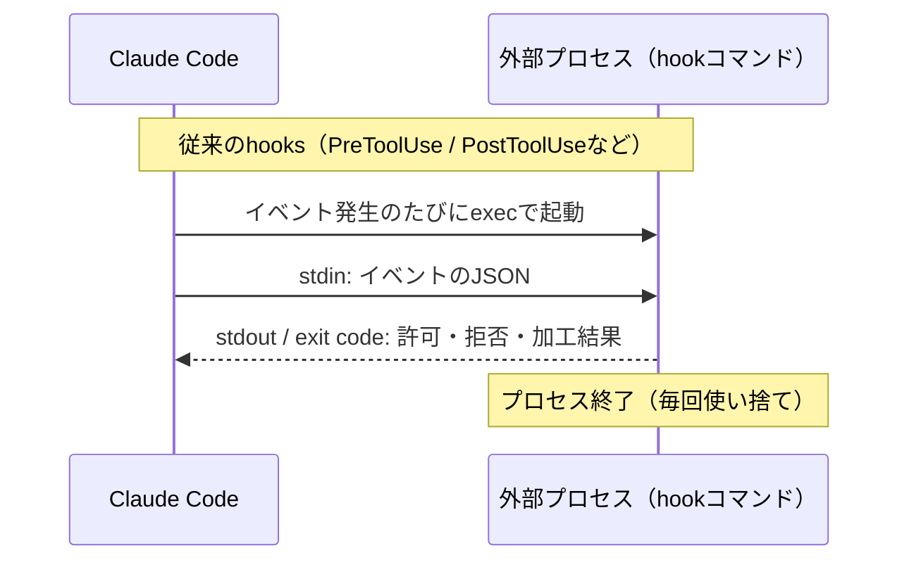
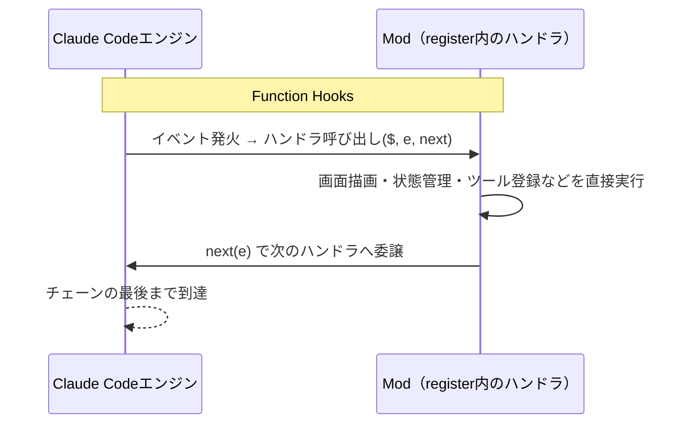

noguです。

2026年10月1日、Claude Codeの**Claude Mods**が正式に発表されました。

https://x.com/ClaudeDevs/status/2105721434807083061?s=20

これは、TypeScriptの関数を用いて、Claude Codeの機能や見た目を自由かつ安全にカスタマイズできる拡張機能の仕組みです。個人的に、この機能は**かなり将来性の高い機能**だと感じています。

本記事では、Claude Modsの機能について深掘りするとともに、どのように活用していくことができるのかまとめていきます。

これからModを始める方が、仕組みを理解し、自分で作って配れるようになるまでを、1本にまとめました。

**対象読者**

- Claude Codeを使っていて、従来のhooksやプラグインでは物足りなくなってきた方
- Modという言葉は聞いたが、何ができて、どう作るのかがわからない方

**この記事でわかること**

- Claude Modsの仕組み（`register`、`($, e, next)`、5層のチェーン）
- 公式やコミュニティのModから見る、Modでできること
- 状態管理・テスト・配布まで含めた、Modの作り方
- すべてのイベントと`$`のAPI一覧

early access版の前回記事を読んだ方は、末尾の[前回の記事からの変更点](#前回の記事からの変更点)を読めば、差分を把握できます。

https://zenn.dev/nogu66/articles/claude-code-function-hooks-claude-mods

https://x.com/bcherny/status/2099551291601248485?s=20

https://claude.com/blog/claude-code-mods

## Claude Modsとは

Claude Mods（以下、Mod）とは、Claude Codeの機能や見た目をカスタマイズできる、プラグインの仕組みです。

**特徴として、CLIだけではなく、デスクトップアプリのカスタマイズもすることが可能です。**

これまでもClaude Codeには「Hooks」という拡張の仕組みがあり、ツール実行の前後などのタイミングで、自分で用意したコマンドを実行できました。Modはその発展形です。

コマンドではなくTypeScriptの関数として書き、Claude Code本体に直接組み込みます。**そのため、コマンドを叩くだけでは届かなかった画面表示の変更やツールの追加まで、踏み込んで手を加えられます**（この仕組み自体は「Function Hooks」と呼ばれていて、詳しくは次章で説明します）。

```bash
example-mod/
├── .claude-plugin/
│   ├── plugin.json      # プラグインのメタ情報
│   └── types/           # Claude Codeが自動で書き出す型定義
├── hooks/
│   ├── hooks.json       # どのモジュールをフックとして使うか宣言
│   └── register.ts または register.tsx      # register(on, options) の実体
├── types/
│   └── index.d.ts       # 自分のModが持つ状態の型（$.stateを使う場合）
└── tests/
    └── example.test.ts  # claude plugin test で動かすテスト
```

Modは、外付けの拡張機能ではありません。Claude Code自身に標準搭載されている[`/diff`コマンド](https://github.com/anthropics/claude-code/tree/main/mods/diff)やテレメトリ機能も、Modとして実装されています。さらに、Claude Code 2.1.277で追加された`AGENTS.md`のサポートも、[`agents-md`](https://github.com/anthropics/claude-code/tree/main/mods/agents-md)というModとして提供されています。**つまり、Claude Modsは、Claude Codeの標準機能自体を拡張できるということです。**

https://x.com/trq212/status/2101009393731223817?s=20

公式のmodsフォルダには、現時点で4つのModが用意されています。興味がある方はこちらをご覧ください。

https://github.com/anthropics/claude-code/tree/main/mods

## Modを使うための準備

Modは、Claude Code 2.1.287以降で使えます。最初から有効なので、特別な設定は要りません。

まず、バージョンを確認します。古い場合は`claude update`で更新します。

```bash
claude --version
```

Modを試すときは、`--plugin-dir`でModのフォルダを指定して起動します。インストールせずに、そのセッションだけで試せます。

```bash
claude --plugin-dir ./my-mod
```

Modのエントリポイントは、`hooks/hooks.json`の`modules`で指定します。

```json:hooks/hooks.json
{
  "modules": ["./register.ts"]
}
```

保存すると実行中のセッションにホットリロードされるため、Claude自身にModを書かせながら試すこともできます。

## Function Hooksとは

前章でも説明した通り、Function Hooks（関数フック）とは、Modの基盤となるClaude Codeのハーネス（プログラム）自体を差し替えるようなフックです。

:::message
「Function Hooks」は、設計の提案（Issue #91870）や型定義のコメントで使われている呼び名です。公式ブログは、同じものを「mods」と「hook」で説明しています。本記事では、Modを支える仕組みを指すときにFunction Hooksと呼びます。
:::

従来のhooksは、対象イベントが起きるたびにClaude Codeが外部プロセスを起動し、標準入力にイベントのJSONを渡します。それを、標準出力や`exit code`で許可・拒否・加工結果を受け取る仕組みでした。

**プロセスをまたぐため、やり取りできるのはテキストの入出力と可否判定までです**。



**一方、Function Hooksは、TypeScriptの関数としてClaude Codeを動作させるエンジンプロセスに直接ロードされます。**

`register(on, options)`という関数の中で、`on(イベント名, ハンドラ)`という形でイベントごとの処理を登録します。

ハンドラは`($, e, next)`という3つの引数を受け取る関数で、`$`がエンジンの操作窓口、`e`がそのイベントの入力データ、`next`が次のハンドラへ処理を渡す関数です。プロセスを挟まず同じメモリ空間で呼ばれるので、`$`を通じて画面描画・状態管理・ツール登録まで直接コントロールすることができます。

この`(e, next)`という形（`$`はエンジン固有のユーティリティだと考えてください）は、Express、Koaの**ミドルウェアパターン**そのものです。`next()`を呼べば次のハンドラに処理を委ね、呼ばなければそこで処理を止められます。



両者を図にすると、違いは「プロセスをまたぐかどうか」に集約されます。

## Claude Modsの基本形

### register(on, options) と ($, e, next)

前章で記載の通り、Modの核となるのは、次のコードです。

```ts
export function register(on) {
  on("イベント名", { /* マッチャー（省略可） */ }, async ($, e, next) => {
    /* ここに処理を書く */
  })
}
```

`register`の中で`on`を呼び、「どのイベントに」「どんな処理をつなぐか」を登録します。第2引数の**マッチャー**は、イベントの絞り込み条件です。たとえば`{ tool: "Bash" }`と書けば、Bashの`tool.call`だけを拾えます。マッチャーは省略できます。

`on`に渡すハンドラは、常に次の3つの引数を受け取ります。

| 引数 | 役割 |
|---|---|
| `$` | エンジンとの唯一の接続窓口。画面描画・モデル・ストレージ・タイマー・ツール登録など、外の世界に触れる手段はすべて`$`経由。`$`のメソッドは、それ自体がイベントでもある |
| `e` | そのイベントの入力データ。フラットな値で、凍結されている。書き換えるときは、コピーを`next`に渡す。idは固定（pinned）で書き換えられない |
| `next` | 次の処理へ進む関数 |

Modが外の世界に触れる手段は、`$`だけです。そのため、Modが何をするのかは、読み込む前に`claude plugin validate`で一覧できます。

:::message alert
Modはサンドボックス化されていません（公式も「Mods aren't sandboxed」と明記しています）。`$`を通せば、ファイルもコマンドもネットワークも、あなたと同じ権限で扱えます。公式ガイドも「ModはClaude Codeと同じアクセス権で動くコードで、書いたのはAnthropicではなく公開者」と注意しています。信頼できる提供元のModだけを入れ、導入前にリポジトリを確認しましょう。
:::

具体例として、基本形のすべてが入ったフックを見てみましょう。`tool.call`で`rm -rf /`を拒否し、入力を書き換え、実行後に通知を出します。

```ts
export function register(on) {
  on("tool.call", { tool: "Bash" }, async ($, e, next) => {
    if (e.command.includes("rm -rf /")) return { deny: "no" }
    const r = await next({ ...e, command: e.command.trim() }) // 下りで入力を書き換え
    $.ui.toast("Bash ran")                                    // 上りで結果を観測
    return r
  })
  .catch(($, e, next) =>                                      // 例外 or タイムアウト時
    next.called ? next(e) : { deny: next.error.kind })
}
```

- `{ tool: "Bash" }`のマッチャーで、Bashの`tool.call`だけを拾います
- `e.command`から、呼ばれようとしているコマンドを読み取れます
- 危険だと判断したら`{ deny: "no" }`を**返して**拒否します。`deny`は`$`のメソッドではなく戻り値です。このとき`next(e)`を呼んでいないので、後続のハンドラには処理が渡りません
- 問題がなければ`await next(...)`で、自分より内側のすべてのフックと、最終的にClaude Code本体（core）の処理を実行し、その結果を受け取ります
- `next({ ...e, command: e.command.trim() })`のように`e`のコピーを渡すと、内側に届く入力を書き換えられます
- `next`から戻ったあとは、結果を見て後処理ができます。ここでは`$.ui.toast`で通知を出し、結果はそのまま返しています
- `.catch`は、ハンドラが例外を投げたり、タイムアウトしたときの後始末です。`next.called`で、すでに`next`を呼んだかどうかを判定できます

**すべてのイベント、APIリファレンスは末尾のAppendixに記載しています。**

### next() はミドルウェア

`next()`は、呼ぶタイミングと戻り値の扱い方次第で、「**前処理**」「**後処理**」「**早期リターン**」のどれにでもなることができます。

**早期リターン**

先ほどの`rm -rf /`の例のように、`next(e)`を呼ばずに`return`すれば、そこで処理チェーンは止まります。coreの代わりに自分が答える形になり、`tool.call`なら`{ deny }`か、独自の結果を返せます。危険な操作の遮断や、権限のない操作の拒否に使うパターンです。

**後処理**

```ts
on('tool.call', async ($, e, next) => {
  const start = Date.now()
  const r = await next(e) // 先に後続のハンドラ→core（実際のツール実行）を走らせる
  $.ui.log(`${e.tool}: ${Date.now() - start}ms`) // 実行後に、トランスクリプトへ1行出す
  return r
})
```

`next(e)`の結果を先に受け取ってから、計測やログ出力などの後処理を差し込めます。Koaの「オニオンモデル」と同じ発想です。

**結果を書き換えて返す**

```ts
on('tool.call', { tool: 'Read' }, async ($, e, next) => {
  const r = await next(e)
  if (r.deny || r.isError || r.result.type !== 'text') return r
  const content = r.result.file.content.replace(/sk-[a-zA-Z0-9]+/g, '[REDACTED]')
  return { result: { ...r.result, file: { ...r.result.file, content } } }
})
```

後続の処理が返した結果をそのまま返さず、加工してから返すこともできます。**ここでは`Read`ツールの出力に混じったAPIキーらしき文字列をマスクしています。**

書き換えるのは`result`です。`next(e)`の戻り値には`text`もありますが、これは「モデルが読んだ文字列」の控えです。`{ ...r, text: ... }`のように差し替えても、モデルに届く内容は変わりません。

### next のその他の機能

`next`には、呼び出す以外にも、次のような機能があります。

| 式 | 説明 |
|---|---|
| `next(e)` | 自分より内側の全フック→coreを実行し、結果を返す |
| `next`を呼ばずにreturn | coreの代わりに自分で答える。`tool.call`なら`{ deny }`、または独自の結果 |
| `next.trace` | await後に参照する。内側の各リンクのplugin / tier / e / result / outcome |
| `next.origin` | 呼び出し元の`{ plugin, tier }`。エンジンが投げた場合は`{ plugin: "engine", tier: "core" }` |
| `next.event` | globや`*`のフック内で、実際にディスパッチされたイベント名 |
| `next.is("tool.*", e)` | 型述語。`e`（と結果）を、マッチするイベントに絞り込む |
| `next.to(e, "append")` | 組織のMod限定（`prependPlugins` / `appendPlugins`）。間の層を飛ばして、より内側のtier（`append` / `builtin` / `core`）で継続する |
| `next(e); next(e)` | 0回以上呼べる。呼ぶたびに、内側で新しいディスパッチが発生する |
| `next.error` / `next.called` | `.catch`内で使う。`{ kind, message, budget }`と、すでにディスパッチしたかどうか。`next(e)`で再実行できる |
| `next.signal` | `AbortSignal`。ユーザーが中断した、または自分の持ち時間が尽きたことを検知する |
| `next.budget` | 自分の持ち時間。`next.budget.remainingMs`で残りを読める |

`.catch`は、ハンドラが例外を投げたり、10秒を超えたときのための宣言です。宣言していなければ、そのハンドラは1行の薄い表示とともにスキップされます。宣言していれば、猶予予算の中で、`next`と同等の権限で代わりに答えられます。

スキップされたハンドラは「いなかった」扱いになり、処理はそのまま内側へ進みます。危険なコマンドを止めるためのハンドラは、`.catch`で`{ deny }`を返すようにしておかないと、失敗したときにコマンドが通ってしまいます。

10秒は、ハンドラ自身のコードが動いた時間だけを数えます。`next(e)`や`$`の呼び出しを待つ時間は含みません。1分かかる`$.model.complete`を呼んでも、持ち時間は減りません。例外は`$.clock.sleep`で、この待ち時間は数えられます。自分で作ったPromiseを待つ時間も同じです。`.catch`の猶予は1秒です。

## 5層のチェーン構造と権限

Function Hooksは、1つのイベントに複数のModが同時にフックしても安全に積み重なるよう、次の5層のチェーンとして実行されます。coreに近づくほど権威は弱くなります。

| 階層 | 内容 |
|---|---|
| prepend | 組織ポリシー |
| user | 自分がインストールしたもの |
| append | 組織ポリシー |
| builtin | バイナリ同梱 |
| core | エンジン本体 |

1つのイベントは、この5層を貫通する1本の「**fold**」（関数型用語のinject/reduceに由来する、元提案者の表現）として流れます。

- **下り**：`e`（入力データ）は各層を通過するたびに加工されうる。組織の層のうち、最後に`e`を見るのが`append`（その内側は、同梱の`builtin`と`core`だけ）
- **core**：Claude Codeのエンジン本体がデフォルトの処理を行う
- **上り**：結果は各層を戻るたびに加工されうる。最後に結果を見るのが`prepend`

組織はこのチェーンの両端、つまり`prepend`と`append`を押さえています。真ん中にいる`user`（自分がインストールしたMod）は、この2つに挟まれる形です。

たとえば`user`のModがあるツール呼び出しをそのまま通しても、その内側の`append`にいる組織のModが、coreに届く前に拒否できます。逆に`prepend`の組織ポリシーが先に拒否すれば、そもそも`user`のModにはイベントが届きません。個人のModが組織のルールを一方的に上書きできないよう、両側を組織で挟んでいるわけです。

組織のModは、`next.to`で`user`の層を飛ばすこともできます。

```javascript
on("*", ($, e, next) => next.to(e, "append"))
```

`prepend`に置いたこの1行は、「すべてのイベント（`*`）を、`user`の層を飛ばして`append`へ渡す」という意味です。`next.to`を呼べるのは、`prependPlugins`か`appendPlugins`に並べた組織のModだけです。個人のModが、組織の層を飛ばすことはできません。

具体例として、Claude Codeが公式に提供する`sec-default`は、この`next.to(e, "append")`を使って組織の持ち物を守る、防御用のModです。Claude Codeに同梱されています。

https://github.com/anthropics/claude-code/tree/main/mods/sec-default

managedな端末、またはTeam/Enterpriseプランの場合、`sec-default`は自動的に最も外側の`prepend`に座ります。その結果、個人がインストールしたプラグインからは、次のものに触れられなくなります。


- 組織の従来hooks
- プロンプトのシステムセクション
- 組織の設定
- 組織提供ツールの説明文
- 設定の`deny`ルール（個人のModが`allow`を返しても、拒否のまま）

なお、組織が`prependPlugins`という設定を使えば、`prepend`という枠自体を組織側で管理できるため、`sec-default`をそこに含めるかどうかも組織が選べます。

### 順序は入れ子構造になっている

チェーンの順序は、関数の入れ子として書けます。

```
X = A · B · C · core = A(B(C(core(⊥))))
```

`A`が最も外側で、`core`が最も内側です。`next(e)`は「自分より内側をすべて実行する」呼び出しなので、外側のフックほど、下りでは最初に`e`を見て、上りでは最後に結果を見ます。つまり、位置がそのまま権威になります。

同じイベントに複数のModがフックした場合は、読み込まれた順に並びます。先に読み込まれたModが、イベントを最初に見て、結果を最後に見ます。

チートシートでは、この構造を3つの視点で描いています。

- **正面から見ると、シーケンス図**：実行→`next(e)`を呼ぶ→中空で待つ→再開
- **横から見ると、リング**：各バーは輪になっていて、その空洞の中身が、内側の呼び出し
- **上から見ると、玉ねぎ**：`core`が最も内側の殻。外側ほど権威が強い

**誰でも名詞を追加できる**

`engine.create`は、`$`そのものを組み立てるイベントです。ここに戻り値を足せば、`$`に新しい名詞を増やせます。

```ts
on("engine.create", async ($, e, next) => ({ ...await next(e), audit: { record } }))
```

`$`に`audit`という名詞を追加する例です。公式の`telemetry`Modが`$.telemetry`（`log`、`mark`）を追加しているのも、同じ仕組みです。

### ルール一覧（Rules of the Road）

Function Hooksの挙動を支えているのが、次のルール群です。

| ルール | 内容 |
|---|---|
| spelling（綴り） | `$`は必ず`$.noun.verb(...)`という形でリテラルに書く。`on("event")`のイベント名も同様。ローダーが静的に列挙するため、動的に組み立てた名前は認識されない |
| identity（識別子） | `e`上の一部のid（`tool`、`tool_use_id`、`agentId`など）は固定（pinned）で書き換え不可。それ以外のペイロードは自由に書き換えてよい |
| failure（失敗） | ハンドラがthrowするか10秒を超えると、そのハンドラだけがスキップされる。`.catch`を宣言していれば、猶予予算の中で`next`と同等の権限で代わりに答えられる。返り値の型が不正な場合も同様にスキップされる |
| recursion（再帰） | ハンドラは、自分自身が引き起こしたディスパッチ（自分の`$`呼び出し、自分の`next`、自分が起動したサブエージェント）を見ない。兄弟ハンドラや他プラグインからは見える |
| trust（信頼） | プラグインは、プロセスと同じ到達範囲を持つ信頼済みコードとして扱われる。組織は`plugin.register`にフックして、各プラグインが宣言する`uses`を確認し導入を拒否できる |
| classic（従来hooks） | 従来の`settings`フックはすべて`classic.<Event>`として1:1でラップされ、JSONの入出力もそのまま引き継がれる |
| orgs（組織） | managedな端末、またはTeam/Enterpriseプランでは、`sec-default`が最外殻に座るため、個人のプラグインはclassic hooks・プロンプトのセクション・設定の読み取り・組織提供ツールの説明文に触れられない。`prependPlugins`を設定した組織はそのtierを所有し、`sec-default@builtin`をそこに列挙するかどうかを選べる |
| globs（グロブ） | `on("tool.*")`、`on("classic.*")`、`on("*")`のようにワイルドカードで複数イベントをまとめて拾える。`e`はマッチする複数イベントの和集合型になる |
| agents（サブエージェント） | サブエージェント内の`tool.call`は`agentId`を持つ。`$.agent.list()`で、name / parentId / typeに解決できる。Origin（どのプラグインか）とagent（どのループか）は別の軸 |
| loading（読み込み） | `plugin.json` + `hooks/hooks.json`（`{ "modules": ["./hooks.js"] }`）で読み込まれる。`claude --plugin-dir ./my-mod`は保存時にホットリロードされ、Claude自身にModを書かせることもできる |

## ユースケース

Modで何ができるのかは、実在するModを見るのがいちばん早いです。ここでは、公式が提供しているModと、コミュニティが作ったModを紹介します。

### diff：セッションの変更をパネルに表示する

[diff](https://github.com/anthropics/claude-code/tree/main/mods/diff)は、`/diff`コマンドの実体です。

https://github.com/anthropics/claude-code/tree/main/mods/diff

セッション中の未コミットの変更を、トランスクリプトの横のパネルに、ファイルごと・変更箇所（hunk）ごとに表示します。Claudeがファイルを編集したりコマンドを実行するたびに、表示も自動で更新されます。


比較の基準も切り替えられます（`HEAD`との差分、セッション開始時のスナップショット、デフォルトブランチとのmerge-base）。

コマンドを1つ足すだけでなく、画面の一部をModが描いている点がポイントです。従来のhooksでは、ここまで踏み込めませんでした。

`/diff`はModなので、`/plugin`からオフにしたり、自分で書いた版に差し替えたりできます。Anthropicは、ほかの標準機能も順にModへ移す計画です。Claude Codeを小さな核まで削り、必要なものだけ足し直す使い方ができるようになります。

### agents-md：AGENTS.mdをプロジェクト指示として読む

[agents-md](https://github.com/anthropics/claude-code/tree/main/mods/agents-md)は、Claude Codeが`CLAUDE.md`を読むのと同じ形で、`AGENTS.md`をプロジェクト指示として読み込むModです。前述のとおり、Claude Code 2.1.277のAGENTS.mdサポートは、このModで実現されています。

https://github.com/anthropics/claude-code/tree/main/mods/agents-md

`instructionFiles`オプションで、読み込み方を4つのモードから選べます。

| モード | 動作 |
|---|---|
| `claude-md` | `CLAUDE.md`のみを読む（Modは実質無効） |
| `claude-md-or-agents-md`（デフォルト） | プロジェクトに`CLAUDE.md`がなければ、`AGENTS.md`にフォールバックする |
| `claude-md-and-agents-md` | 両方を読む |
| `managed-only` | 組織管理の指示ファイルのみを使う |

組み込みのModなので、`/config`の「Project instructions」から切り替えられます。手で書く場合は、`pluginConfigs`に設定します。

```json
{
  "pluginConfigs": {
    "agents-md@builtin": {
      "options": { "instructionFiles": "claude-md-and-agents-md" }
    }
  }
}
```

READMEによると、中心は`prompt.context`へのフックです。エンジンが読み込んだ指示ファイルの一覧を受け取り、`$.fs.ancestors`で見つけた`AGENTS.md`を、プロジェクトの指示ファイルとして足して返します。サブディレクトリの`AGENTS.md`は、`tool.call`（Read）で動的に添付しています。ハーネスの標準的な挙動を、イベントへのフックだけで差し替えている例です。

https://x.com/trq212/status/2101009393731223817

### sec-default：組織のポリシーを守る

[sec-default](https://github.com/anthropics/claude-code/tree/main/mods/sec-default)は、組織のクラシックなhooks、プロンプトの内容、管理設定、ツールポリシーを、ユーザーがインストールしたプラグインから守るModです。自分では新しいポリシーを足さず、「触れさせない」ことだけを担います。

https://github.com/anthropics/claude-code/tree/main/mods/sec-default

managedな端末やTeam/Enterpriseの組織では、最も外側の`prepend`に座ります。仕組みは、前章の「5層のチェーン構造と権限」で説明したとおりです。

公式ブログは、チームでの使い道として次の3つを挙げています。

- **CI/CDの状況表示**：会話の横のペインにパイプラインの状況を出し、ビルドの成否に合わせて更新する
- **本番環境の保護**：本番の設定に触れるコマンドの前に、確認を必須にする
- **監査ログ**：最初に読み込まれるModが、ほかのすべてのModの呼び出しを記録する

Modはプラグインに入れて配るため、既存のプラグイン管理がそのまま効きます。管理者は、marketplaceの許可・ブロックを管理コンソールから設定できます。

### terminal-browser：ターミナル内でブラウザを開く

:::message
**追記(2026/9/22)**
v2.1.278 時点において、Claude Codeの特殊文字列バグが発生しているため正常に動作しないことを確認
:::

[terminal-browser](https://github.com/zenbu-labs/terminal-browser/tree/main/claude-code-plugin)は、Kitty graphics protocolを使い、Claude Codeの分割ペインの中に実際のブラウザを表示するコミュニティ製のModです。`/browser`コマンドで起動できます（Ghostty、Kitty、libghosttyベースのターミナルに対応）。

https://github.com/zenbu-labs/terminal-browser/tree/main/claude-code-plugin

READMEには、他のプラグインからブラウザを開く例として、次のコードが載っています。

```ts
on('command.run', { command: 'tldraw' }, async ($) => {
  const result = await $.browser.open({ url: 'https://www.tldraw.com/' })
})
```

`command.run`で独自のスラッシュコマンドを受け取り、`$.browser.open()`でブラウザを開く流れです。`open()`と`close()`は、このModが他のプラグイン向けに提供しているAPIです。

https://x.com/RobKnight__/status/2100622380439683541?s=20

### 共通しているのは「標準機能と同じ土俵」

`diff`や`agents-md`のような公式の標準機能も、terminal-browserのようなコミュニティ製Modも、同じ`register`とイベントへのフックで作られています。「画面を描く」「指示の読み込み方を変える」「組織のルールを守る」「ブラウザを埋め込む」と、方向性はばらばらでも、書き方は変わりません。

## 実践：自分のModを作って配る（turn-counter）

ここからは、自分でModを作ります。題材は、セッションのターン数をプロンプト欄の上に表示する小さなMod「turn-counter」です。状態管理から始めて、型定義の確認、検証、テスト、配布の順に進めます。**この章のコードは、すべてClaude Code 2.1.287で動作を確認しています。**

```
my-mods/
├── .claude-plugin/
│   └── marketplace.json
└── turn-counter/
    ├── .claude-plugin/
    │   └── plugin.json
    ├── hooks/
    │   ├── hooks.json
    │   └── register.mjs
    ├── types/
    │   └── index.d.ts
    └── tests/
        └── turn-counter.test.ts
```

### 状態は`$.state`に置く

まず、ターン数をどこに持つかを決めます。

Modのファイルを保存すると、ホットリロードで`register()`が実行し直されます。このとき、モジュール変数は初期値に戻ります。カウンタをモジュール変数に持つ書き方では、保存のたびに値が消えてしまいます。

`$.state`は、この問題を解決します。値をModのファイルではなくホスト側に置くので、ホットリロードのあとも値が残ります。

```js:hooks/register.mjs
// ホスト側に置く値。このファイルがホットリロードされても消えない
const turns = { plugin: "turn-counter", key: "turns" }

export function register(on) {
  on("turn.complete", async ($, e, next) => {
    const r = await next(e)
    if (!e.agentId) {                       // サブエージェントのターンは数えない
      const { value = 0 } = await $.state.get(turns)
      await $.state.set(turns, value + 1)
    }
    return r
  })

  on("ui.render", { component: "AbovePrompt" }, async ($, e, next) => {
    const { value = 0 } = await $.state.get(turns) // 描画中のgetが、再描画の購読になる
    if (value === 0) return next(e)
    const { Text } = $.ui.resolve(e)
    return Text({ dimColor: true, children: `このセッション ${value} ターン目` })
  })
}
```

`ui.render`の中で`$.state.get`を呼ぶと、その描画が値を購読します。あとで値が`$.state.set`で書き換わると、その描画は自動で描き直されます。再描画が自動になるので、`$.ui.invalidate('ui.render')`を呼ぶ必要はありません。

プロンプト欄の上の帯（`AbovePrompt`）は、すべてのModで共有しています。ツリーを返すと、自分より内側のModが描いた内容を置き換えます。残したいときは、`await next(e)`の結果を`Box`の子に入れます。

どのModも値を読めますが、書けるのは持ち主のModだけです。また、`ui.render`の描画中には`$.state.set`を呼べません。書き込みは、ほかのイベントやボタンの`onPress`から行います。

`$.state`の値は、型の「契約」として宣言する必要があります。契約ファイルの場所は、`plugin.json`の`types`で指定します。

```json:.claude-plugin/plugin.json
{
  "name": "turn-counter",
  "version": "0.1.0",
  "description": "ターン数をプロンプト欄の上に表示する",
  "author": { "name": "nogu" },
  "types": "./types/index.d.ts"
}
```

```ts:types/index.d.ts
export type TurnCount = number

declare module "claude-code" {
  interface PluginState {
    "turn-counter": { turns: TurnCount }
  }
}
```

```json:hooks/hooks.json
{
  "modules": ["./register.mjs"]
}
```

:::message alert
契約ファイルに書けるのは、`export type`と`export interface`だけです。私は最初、モジュール扱いにするために`export {}`を置いて、`claude plugin validate`にエラーで止められました。宣言していないキーを`$.state`で使った場合も、同じくエラーになります。
:::

`$.store`との使い分けは、次のとおりです。

| | `$.state` | `$.store` |
|---|---|---|
| 寿命 | セッションの間（`/clear`、`/resume`、`/branch`で初期値に戻る） | セッションをまたいで永続化（マシン上の全セッションで共有） |
| ホットリロード | 残る | 残る |
| 再描画 | 描画中の`get`が自動で購読する | しない |
| 型の宣言 | `PluginState`に必要 | 不要 |

画面に出す値は`$.state`、次回の起動でも使いたい値は`$.store`と覚えておけば十分です。

### 起動して、型定義を確認する

ファイルがそろったので、`my-mods/`の中で起動します。

```bash
claude --plugin-dir ./turn-counter
```

1回やり取りすると、プロンプト欄の上に「このセッション 1 ターン目」と表示されます。

次に、起動したまま`register.mjs`の「このセッション」を「ここまで」に書き換えて保存します。トランスクリプトに`turn-counter: reloaded (2 hooks: turn.complete, ui.render)`と出て、表示が「ここまで 1 ターン目」に変わります。コードは入れ替わりましたが、数字は`$.state`にあるので消えていません。

:::message
表示が出ないときは、起動したフォルダを信頼しているかを確認します。信頼していないフォルダでは、Modはエラーも出さずに読み込まれません。読み込まれたかどうかは、`/plugin`を開くと`1 mod active · turn-counter`のように表示されます。詳しく調べるときは、`claude --debug-file debug.log`で起動し、ログに`hooks module turn-counter@inline loaded`と出ているかで判断できます。
:::

Claude Codeは、Modを読み込むたびに、そのModの`.claude-plugin/types/`へ型定義を書き出します。起動したあとには、次のファイルができています。

```
turn-counter/
├── .claude-plugin/
│   └── types/
│       ├── .gitignore
│       ├── tsconfig.json
│       ├── claude-code/index.d.ts        # イベントと$の型（約570KB）
│       ├── claude-code-tools/index.d.ts  # 組み込みツールの入出力の型
│       └── claude-code-mcp/index.d.ts
└── tsconfig.json
```

`claude-code/index.d.ts`の1行目には、書き出したClaude Codeのバージョンが入ります。バージョンが上がれば、次の読み込みで自動的に書き直されます。**手元のバージョンの仕様は、このファイルが正です。**`$`の使い方やイベントの引数に迷ったら、まずここを検索します。

### `claude plugin validate`で検証する

`claude plugin validate`は、Modのソースを静的に読んで検証します。報告されるのは、どのイベントにフックし、`$`の何を呼び、どの状態を読み書きするかの一覧です。

```bash
$ claude plugin validate ./turn-counter
  ❯ types ./types/index.d.ts declares state: turn-counter.turns
  ❯ ./register.mjs hooks: turn.complete, ui.render{component=AbovePrompt}
  ❯ ./register.mjs calls: $.state.get, $.state.set, $.ui.resolve
  ❯ ./register.mjs state writes: turn-counter.turns
  ❯ ./register.mjs state reads: turn-counter.turns
✔ Validation passed
```

Modが何に触るのかを、セッションで読み込む前に一覧できます。他人のModを入れる前の確認にも使えます。

### `claude plugin test`でテストする

`claude plugin test`は、Modを本物のClaude Codeのランタイムに読み込んでテストします。テストは、名前が`.test.ts`で終わるファイルに書きます（ここでは`tests/`に置きます）。`claude-code/testing`から`test`と`expect`を読み込みます。

```ts:tests/turn-counter.test.ts
import { expect, test } from "claude-code/testing"

test("ターンが終わるたびに表示が増える", async ($, on) => {
  // ここで登録したフックはModの内側で動き、Claude Code本体の答えを代行する
  on("turn.complete", () => ({ text: "" }))

  await $.turn.complete({ reason: "answer", answer: "ok", durationMs: 1 } as any)
  const ui = await $.ui.mount({
    plugin: "turn-counter",
    surface: "terminal",
    component: "AbovePrompt",
    props: { hasSurvey: false, isWorking: false, maxRows: 10, bodyColumns: 120 },
  } as any)
  expect(await ui.find({ type: "Text", text: /1 ターン目/ })).toBeDefined()

  // $.ui.invalidateを呼ばなくても、$.state.setだけで描き直される
  await $.turn.complete({ reason: "answer", answer: "ok", durationMs: 1 } as any)
  expect(await ui.find({ type: "Text", text: /2 ターン目/ })).toBeDefined()

  await ui.unmount()
})
```

```bash
$ claude plugin test ./turn-counter

tests/turn-counter.test.ts:
(pass) ターンが終わるたびに表示が増える [30.81ms]

 1 pass
 0 fail
```

テストの中の`$`は、エンジン側の`$`です。`$.turn.complete(...)`でイベントを起こし、`$.ui.mount(...)`でModに描画させ、返ってきた`ui`から要素を探します。ボタンを押す`ui.press`や、入力する`ui.input`もあります。

テスト内で`on(...)`に登録したフックは、Modより内側（coreの位置）で動きます。このフックは、Claude Code本体の代わりに答えを返すスタブです。

:::message alert
Modが`next(e)`を呼ぶイベントには、テスト内に答えるスタブが必要です。私は最初、ターン数が0のまま`$.ui.mount`を呼びました。Modはターン数が0のとき`next(e)`を呼ぶため、`ui.render`に答える相手がおらず、`no implementation for ui.render`で失敗しました。上の例では、先に1ターン進めてから描画しています。
:::

### marketplaceで配布する

Modはプラグインの一部なので、配布にもプラグインと同じ仕組みを使います。リポジトリのルートに、marketplaceのマニフェストを置きます。

```json:.claude-plugin/marketplace.json
{
  "name": "my-mods",
  "description": "noguの自作Mod置き場",
  "owner": { "name": "nogu" },
  "plugins": [{ "name": "turn-counter", "source": "./turn-counter" }]
}
```

リポジトリのルートで`claude plugin validate .`を実行すると、このマニフェストを検証できます。Mod本体のフックや状態まで確認するときは、`claude plugin validate ./turn-counter`のようにプラグインのフォルダを指定します。

GitHubに公開したあと、使う側は次の3つのコマンドで導入します。

```bash
/plugin marketplace add <owner>/<repo>
/plugin install turn-counter@my-mods
/reload-plugins
```

さらに広く配りたい場合は、[Claude directory](https://claude.ai/directory)に提出できます。公式ブログによると、Modを含むプラグインはClaude directoryかCLIの`/plugin`から導入できます。

:::message
この節では、マニフェストの検証までを手元で確認しました。導入の3コマンドは、公式ガイドの記載です。
:::

### ターミナルとデスクトップアプリの両方で動く

Modは、ターミナルとデスクトップアプリの両方を対象にできます。

描画の書き方は、どちらでも同じです。`ui.render`のイベントには`e.surface`が入っていて、`$.ui.resolve(e)`がその画面用の`Box`や`Text`を返します。そのため、同じハンドラがそのまま両方の画面で動きます。画面ごとに出し分けたいときは、`e.surface`で分岐します。

テストでも、`$.ui.mount`の`surface`を変えれば、画面ごとの挙動を確認できます。

型定義には`mobile`と`vscode`もありますが、公式ドキュメントによると、Modの描画が表示されるのはターミナルとデスクトップアプリ（Codeタブ）だけです。VS Code拡張のチャットパネルや`claude -p`では、フックは動きますが、描画は出ません。

`ui.render`の`component`に指定できる場所は、2.1.287時点で次の15種類です。

```
AskUserQuestion / UserMessage / AssistantMessage / ToolUse / ToolResult
ToolGroup / ToolProgress / CommandOutput / Spinner / TurnDuration
InfoNotice / SessionMode / PromptHint / AbovePrompt / Pane
```

## APIリファレンス（$カタログ）

`$`の名詞と動詞を、用途別にまとめます。各動詞は、それ自体がイベントでもあり、他のModからフックできます。正確な型は、Modの読み込み時に`.claude-plugin/types/`へ書き出される型定義が正です。

### tool / command / prompt 系

| 名詞 | 動詞 | 説明 |
|---|---|---|
| `$.tool` | `.call` | hooksとpermissionsを通してツールを実行する |
| | `.list` | モデルが今使えるツール一覧を取得する |
| | `.register` | モデルに新しいツールを与える |
| | `.check` | permissionの判定だけを問い合わせる（実行もダイアログ表示もしない） |
| `$.command` | `.run` | `/command`を打鍵したのと同様に実行する |
| | `.list` | 使えるスラッシュコマンド一覧を取得する |
| | `.register` | `/yourcommand`を追加する |
| `$.prompt` | `.submit` | このプラグインとしてプロンプトをキューに入れる |
| | `.fill` / `.suggest` | プロンプト欄に書き込む／ターン後に薄字の提案を出す |
| | `.read` | プロンプト欄の下書きとカーソル位置を読む |
| | `.compose` | システムプロンプトのセクション一覧を得る |

### ui / fs / state / store 系

| 名詞 | 動詞 | 説明 |
|---|---|---|
| `$.ui` | `.log` / `.notice` | トランスクリプトへの1行 ／ ダイアログ下の1行 |
| | `.toast` / `.status` | 通知バー ／ 自分のステータスライン枠 |
| | `.ask` | エンジンのAskUserQuestionダイアログを出す |
| | `.open` / `.close` | pane（描画領域）の開閉 |
| | `.invalidate` | キャッシュ済みイベント（`ui.render`など）を再実行させる |
| | `.resolve` | `e.surface`用のelementコンストラクタ一式を得る |
| | `.panes` | 自分が開いているpaneの一覧を得る |
| | `.scroll` / `.focus` | 要素が見える位置までスクロールする ／ フォーカスを移す |
| | `.blit` | 自分が描いた`Raster` / `Image`を、再描画なしで塗り替える |
| | `.copy` | クリップボードに書き込む |
| `$.fs` | `.read` / `.write` / `.list` | ホストのファイルシステムを操作する（プロセスと同じ到達範囲） |
| | `.stat` / `.exists` | 種類/サイズ/mtimeを見る ／ 例外を投げずに存在確認する |
| | `.ancestors` | cwdより上位にある指示ファイル（named instruction files）を得る |
| `$.state` | `.get` / `.set` | セッション中の名前付きの値。ホットリロードを越えて残り、描画中の`get`は再描画を購読する。`/clear`などで初期値に戻る |
| `$.store` | `.get` / `.set` / `.delete` / `.keys` | プラグイン単位で永続化されるJSONを操作する。マシン上の全セッションで共有される |

### http / process / mcp 系

| 名詞 | 動詞 | 説明 |
|---|---|---|
| `$.http` | `.fetch` | ホスト経由でfetchする。`{ auth }`でauthorizeハンドルを消費できる |
| `$.process` | `.run` | ホスト上でargvを実行する（シェルなし）。`{ exitCode, stdout, stderr }`を受け取る |
| | `.spawn` | コマンドを起動し、出力をストリームで受け取る |
| `$.mcp` | `.call` | 接続済みMCPサーバー上のツールを呼ぶ |
| | `.connect` | 自分のマニフェストに書いたMCPサーバーへ接続する |

### agent / turn / session / model 系

| 名詞 | 動詞 | 説明 |
|---|---|---|
| `$.agent` | `.spawn` | サブエージェントを起動し、終了時にresolveする |
| | `.list` | サブエージェント一覧（id, name, parentId, status） |
| | `.register` | Agentツールが呼べるエージェント種別を、`<plugin>:<name>`の名前で定義する |
| `$.turn` | `.abort` | 実行中のターンをキャンセルする |
| `$.session` | `.id` / `.cwd` / `.repo` / `.model` | 読み取り：識別子・場所・リポジトリ・使用モデル |
| | `.root` / `.version` | 読み取り：プロジェクトのルート・エンジンのバージョン |
| | `.surfaces` / `.turns` | 読み取り：現在接続中のsurface・これまでのターン数 |
| | `.messages` | トランスクリプト（メッセージ単位） |
| | `.usage` | コンテキストウィンドウの使用率、レート制限、コスト |
| | `.compact` | 今すぐcompactを実行する（`/compact`と同様、`session.compact`イベントを経由） |
| | `.send` / `.append` | ほかのエージェントやセッションへメッセージを送る ／ 会話に行を追加する |
| | `.authorize` | 不透明な資格情報ハンドル。`http.fetch`で消費される |
| `$.model` | `.complete` | セッションのクライアントで1回completionする |
| | `.fork` | このトランスクリプト上で、ツールなしのcompletionを行う（キャッシュ共有） |
| | `.classify` | テキストに対して、自分で用意したラベルから1つ選ばせる |

### settings / config / env / clock / audio / telemetry / plugin 系

| 名詞 | 動詞 | 説明 |
|---|---|---|
| `$.settings` | `.read` | 解決済みの設定、または特定ソースのレイヤを読む：`{ source: "policy" }` |
| `$.config` | `.set` / `.list` | `/config`のメニューと同じ経路で、行を変更する／行の一覧を得る |
| `$.env` | `.get` / `.set` | 変数名をリテラルで指定して、1つ取得/設定する（`validate`が読み書き対象を列挙する） |
| `$.clock` | `.now` / `.sleep` / `.after` / `.every` | 時刻とタイマー（キャンセル可） |
| `$.audio` | `.play` / `.speak` | クリップの再生 ／ プラットフォームの音声合成 |
| `$.telemetry` | `.log` / `.mark` | テレメトリの記録（公式の`telemetry`Modが追加する名詞）。使えるのはClaude Code本体と同梱Modだけで、インストールしたModからの呼び出しは拒否される |
| `$.plugin` | `.name` / `.root` | 自分が誰で、どこにいるか |

## 全イベント（カテゴリ別）

2.1.287の型定義にある43個のイベントを、カテゴリ別にまとめます。`on()`には、表の名前をそのまま書きます。

凡例：◆ = coreに副作用あり（`next`を呼ばなければ発生せず、2回呼べば2回発生する）／◇ = coreに副作用なし

### ツール・コマンド系（tool.* / command.*）

| | イベント | 説明 |
|---|---|---|
| ◆ | `tool.call` | `e = { tool, tool_use_id, agentId?, ...input }` → 結果 \| `{ deny }` |
| ◇ | `tool.describe` | モデルに伝えられるツールの説明。`e.provider`＝提供元 |
| ◇ | `tool.check` | permissionの判定 → `{ decision }` |
| ◆ | `command.run` | `/name args` → `{ text }` |
| ◇ | `command.describe` | コマンドの一覧表示内容。`e.provider` |

### プロンプト・ターン・セッション系（prompt.* / turn.* / session.* / agent.*）

| | イベント | 説明 |
|---|---|---|
| ◆ | `prompt.submit` | 送信されたプロンプト（ターン開始前）。`next({ ...e, text })`で書き換え、`{ drop }`で送信を止められる → `{ text, context[] }` |
| ◆ | `prompt.fill` / `prompt.suggest` | 欄への書き込み ／ ターン後の薄字提案。書き換え・拒否可 |
| ◇ | `prompt.context` | 会話の最初のユーザーメッセージに載るcontextブロック。会話ごとに1回 → `{ blocks }` |
| ◆ | `prompt.edit` | 入力欄が編集・貼り付けされた。戻り値の`decorations`で、入力中の文字に色や太字を付けられる |
| ◇ | `prompt.section` | システムプロンプトのセクション1つを組み立てるとき → `{ text }` |
| ◇ | `prompt.compose` | システムプロンプト全体を組み立てるとき → `{ sections }`。セクションの追加・差し替え・並べ替え・削除ができる |
| ◇ | `prompt.attachment` | エンジンがモデル向けに自動で差し込むメッセージ（リマインダー、メンションされたファイルなど）。`{ text: null }`で外せる |
| ◇ | `turn.start` | `{ turnId, text }`・ターン開始前 |
| ◆ | `turn.step` | モデルへの1リクエスト（ストリーミング）。`async function*`で書き、`yield* next({ ...e, model, effort })` |
| ◇ | `turn.complete` | `{ text }`・usage・ターン終了後 |
| ◇ | `session.start` | `{ cwd, ... }`・Modごとに、最初のプロンプトの前に1回。そのModがリロードされるたびにもう1回（`/clear`の後には来ない） |
| ◇ | `session.receive` | 受信データがcontextに入る前 → `{ text }` \| `{ consumed }` |
| ◆ | `session.compact` | `{ trigger, instructions?, messages }` → `{ messages }` \| `{ skip }` |
| ◇ | `session.attach` / `session.detach` | surface（デスクトップ・スマホ）の接続/切断：`{ surface, clientId }` |
| ◆ | `session.append` | 会話に行が保存される前。内容を書き換えられる |
| ◆ | `session.send` | ほかのエージェントやセッションへメッセージを送る前。書き換え・宛先変更・拒否ができる |
| ◇ | `session.measure` | コンテキスト使用率やレート制限が動いたときの通知。ポーリングせずに監視できる |
| ◆ | `session.end` | セッション終了時と、`/clear`・`/resume`・`/branch`の実行時。`e.reason`で理由がわかる |
| ◆ | `agent.spawn` | `{ prompt, model, provider, parentAgentId?, ... }` → `{ model }` \| `{ deny }` |
| ◇ | `agent.offer` | モデルに提示されるエージェント種別 |

### UI描画系（ui.*）

| | イベント | 説明 |
|---|---|---|
| ◇ | `ui.render` | `{ surface, component, props }` → elementツリー |
| ◆ | `ui.press` / `ui.input` | 自分が描いたButton/Inputが使われた |
| ◆ | `ui.select` | 自分が描いた`Select`から選ばれた |
| ◆ | `ui.scroll` / `ui.focus` | paneやプロンプト上の帯がスクロールされる前 ／ フォーカスが動く前 |
| ◆ | `ui.message` | 自分のClient surfaceモジュールが投稿したデータ |
| ◇ | `ui.resolve` | あるsurface用のelementテーブル |

### 設定・組織・プラグイン系（config.* / plugin.register / classic.* など）

| | イベント | 説明 |
|---|---|---|
| ◆ | `config.set` | `/config`行の変更：`{ key, value, previous, provider }` → `{ value }` \| `{ deny }` |
| ◇ | `config.describe` | メニュー上の行の表示。ラベル変更や非表示化 |
| ◇ | `skill.prompt` | スキルのテキストがロードされる際 |
| ◇ | `attribution.text` | コミットやPRに付ける文言を、エンジンが組み立てるとき → `{ text }` |
| ◆ | `telemetry.log` | テレメトリの記録が送られる前。記録の中身を書き換えられる。インストールしたModでフックするには、`{ to: "collector" }`のマッチャーが必要 |
| ◇ | `telemetry.mark` | 機能が1回使われたことの記録。エンジン自体は何もせず、公式のModが拾う |
| ◇ | `engine.create` | `$`のfold自体：名詞の追加・除去 |
| ◇ | `plugin.register` | 導入審査：`{ name, tier, uses[] }` → 許可 \| 拒否 |
| ◆ | `classic.*` | 従来のsettingsフックと同一のJSON入出力。シェルhooksがそのseamのcore |
| ◆ | `*` | 上記すべてのイベント（telemetryを除く）、および全`$`操作（`fs.read`、`http.fetch`、`store.set`など）を、自分の位置・同じ権限で書き換え・拒否・`next.to`できる |

## 自分で作るには

1. `.claude-plugin/plugin.json` と `hooks/hooks.json` を用意
2. `hooks/register.ts` に `export const register: Register = on => { on('イベント名', ($, e, next) => {...}) }` を書く
3. `claude --plugin-dir .` で一度起動し、`.claude-plugin/types/` に書き出された型定義で仕様を確認
4. 状態を持つなら、`types/index.d.ts` に `PluginState` を宣言し、`plugin.json` の `types` で指す
5. `claude plugin validate .` でフック登録と状態の読み書きを検証
6. `tests/` にテストを書き、`claude plugin test .` で実行
7. 保存すると実行中セッションにホットリロードされる
8. 配るときは `marketplace.json` を置き、GitHubに公開する

## 前回の記事からの変更点

この章は、[early access版の前回記事](https://zenn.dev/nogu66/articles/claude-code-function-hooks-claude-mods)を読んだ方に向けた、差分のまとめです。初めての方は、読み飛ばして構いません。

**骨格は変わっていません。**`register(on, options)`、`($, e, next)`、5層のチェーン、`.catch`、公式の4つのModは、前回のままです。変わったのは、有効化・型定義・状態管理・テスト・配布という「入口」の部分です。

| 項目 | early access版（2.1.278） | 現在（2.1.287） |
|---|---|---|
| 有効化 | 環境変数`CLAUDE_CODE_ENABLE_FUNCTION_HOOKS=1`が必要 | 最初から有効。設定は不要 |
| 型定義 | `/plugin-types`で`.claude/types/claude-code.d.ts`を生成 | `/plugin-types`は廃止。Modを読み込むたびに`.claude-plugin/types/`へ自動で書き出される |
| `types/`フォルダ | 生成した型定義の置き場 | 自分のModの状態の型（`PluginState`）を宣言する場所 |
| 状態管理 | モジュール変数か`$.store` | `$.state`が追加。ホットリロードを越えて値が残り、再描画も自動 |
| テスト | `claude plugin validate`のみ | `claude plugin test`と`claude-code/testing`が追加 |
| 配布 | `--plugin-dir`か`git clone` | marketplaceから`/plugin install`。Claude directoryにも提出できる |
| 対象の画面 | 前回はターミナルだけを扱った | 公式に、ターミナルとデスクトップアプリの両方が対象 |
| 位置づけ | Issue #91870で議論中の暫定仕様 | 2026年10月1日に正式発表。公式ドキュメントあり |
| API | イベント38個 | イベント43個。削除されたものはなし |

### 手順で変わったところ

- **環境変数が不要になった**：2.1.287では、`CLAUDE_CODE_ENABLE_FUNCTION_HOOKS`がなくてもModが読み込まれることを確認しました。2.1.287以降はこの変数を無視するので、`~/.claude/settings.json`に残っている場合は消しておきます
- **`/plugin-types`がなくなった**：型定義は、`--plugin-dir`で一度起動すれば書き出されます。前回の「自分で作るには」の手順3は、この起動に置き換わりました
- **状態の型の宣言が必要になった**：`$.state`を使うときは、`plugin.json`の`types`で契約ファイルを指します
- **テストと配布の手順が増えた**：`claude plugin test`と、marketplaceのマニフェストです

### 追加されたAPI

2.1.278と2.1.287の型定義を比べた結果です。削除されたイベントや動詞はありません。

- **イベント（5個）**：`prompt.compose`、`session.append`、`session.send`、`telemetry.log`、`telemetry.mark`
- **`$`の動詞（6個）**：`$.state.get`、`$.state.set`、`$.mcp.connect`、`$.process.spawn`、`$.session.version`、`$.ui.copy`

### 表に足したもの、書き方を変えたもの

前回のAPIリファレンスとイベント一覧は、公式チートシートをもとにしていました。今回は、2.1.287の型定義をもとに、載っていなかったものを足しています。

- **イベント名を完全な名前に統一した**：前回は`step`、`compact`、`press`のように省略して書いていました。今回は、`on()`に書く名前（`turn.step`、`session.compact`、`ui.press`）にそろえています
- **当時からあったが載せていなかったイベント（9個）**：`prompt.edit`、`prompt.section`、`prompt.attachment`、`ui.select`、`ui.scroll`、`ui.focus`、`session.measure`、`session.end`、`attribution.text`
- **当時からあったが載せていなかった`$`の動詞**：`$.ui.blit`、`$.ui.panes`、`$.ui.scroll`、`$.ui.focus`、`$.prompt.read`、`$.prompt.compose`、`$.tool.check`、`$.agent.register`、`$.session.root`、`$.session.send`、`$.session.append`
- **`next`の表**：`next.signal`と`next.budget`を足しました。どちらも当時からあった機能です
- **`prompt.context`の説明を直した**：前回は「ターンごと」と書きましたが、型定義では「会話ごとに1回」です
- **結果の書き換え方を直した**：前回は`{ ...r, text: ... }`と書きましたが、2.1.287ではモデルに届く内容が変わりません。`{ result }`を返す形に直しました
- **`append`の位置を直した**：前回は「外側の`append`」と書きましたが、`append`は`user`の内側です。`next.to`の説明も、組織のModが`user`の層を飛ばす機能として書き直しました
- **`agent.spawn`の戻り値を直した**：`{ text }`ではなく、`{ model }`か`{ deny }`です

:::message
足した14個のイベントの◆/◇は、公式の表記がありません。型定義の説明文をもとに、私が判断しました。◆にしたのは、`prompt.edit`、`ui.select`、`ui.scroll`、`ui.focus`、`session.append`、`session.send`、`session.end`、`telemetry.log`です。
:::

### 補足した説明

- **安全性の注意**：Modはサンドボックス化されておらず、`$`を通せばClaude Codeと同じ範囲に届きます
- **10秒の数え方**：`next(e)`や`$`の呼び出しを待つ時間は、持ち時間に含みません
- **読み込み順**：同じイベントにフックしたModは、読み込まれた順に並びます
- **`/diff`の差し替え**と、**チームでの使い道**：公式ブログの内容を足しました
- **新しい章**：「実践：自分のModを作って配る（turn-counter）」は、すべて今回書き下ろしました

## まとめ

Claude Modsは、**「外部プロセスを挟まずにClaude Code自身を拡張したい」という問題を解決する**仕組みです。

従来のhooksでも「イベントに反応して何かする」ことはできましたが、できることはテキストの入出力と可否判定までに限られていました。Claude Modsは、TypeScriptの関数としてエンジンに直接ロードされることで、画面描画・状態管理・ツール登録まで踏み込めるようになりました。Claude Code自身の`/diff`やテレメトリ機能がModとして実装されているのは、その象徴だと思います。

**このことからも、Claude Modsは、Claude Codeハーネス自体をかなり深くカスタマイズすることができる機能であり、かなり将来性の高い機能であると言えます。**

覚えることは、`register`と`($, e, next)`という1つの形だけです。その形のまま、`$.state`で状態を持ち、`claude plugin test`でテストし、marketplaceで配るところまで進めます。

まずは`claude --plugin-dir`で小さなModを1つ動かし、書き出された型定義を眺めてみてください。

---

この記事が役に立ったら、Xをフォローしていただけると嬉しいです!

https://x.com/_nogu66

## 参考リンク

- [Customize Claude Code with mods（公式ブログ）](https://claude.com/blog/claude-code-mods)
- [Getting started with Claude Code mods（公式ガイド）](https://claude.dev/blog/getting-started-with-claude-code-mods/)
- [Mods 公式ドキュメント](https://code.claude.com/docs/en/plugins/mods/overview)
- [Claude Mods 入門（early access版の前回記事）](https://zenn.dev/nogu66/articles/claude-code-function-hooks-claude-mods)
- [Claude Code Issue #91870（Function Hooks提案）](https://github.com/anthropics/claude-code/issues/91870#issuecomment-5666255143)
- [cc-arcade（実例プラグイン）](https://github.com/sezaakgun/cc-arcade)
- [Claude Code 公式 Mods](https://github.com/anthropics/claude-code/tree/main/mods)
- [awesome-claude-code-mods](https://github.com/karanb192/awesome-claude-code-mods)
- [terminal-browser](https://github.com/zenbu-labs/terminal-browser/tree/main/claude-code-plugin)
