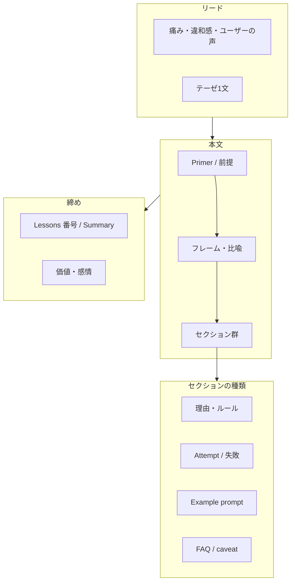

# テクニカルライティングガイド

このノートは `notes/Clippings/technical-writing/` にある [@trq212](https://x.com/trq212)（Claude Code チーム）の記事6本を分析し、**日本語の技術記事**を書くときの構成・ストーリー展開の参考としてまとめたものです。

---

## 参考元記事一覧

| シリーズ | 原文 | 日本語訳 | 主な型 |
|---------|------|----------|--------|
| Using Claude Code | [[Using Claude Code The Unreasonable Effectiveness of HTML]] | [[ja/Using Claude Code The Unreasonable Effectiveness of HTML]] | 実践ガイド |
| Using Claude Code | [[Using Claude Code Session Management & 1M Context]] | [[ja/Using Claude Code Session Management & 1M Context]] | 実践ガイド（判断フレーム） |
| — | [[Making Playgrounds using Claude Code]] | [[ja/Making Playgrounds using Claude Code]] | プロダクト紹介 |
| Lessons from Building | [[Lessons from Building Claude Code Prompt Caching Is Everything]] | [[ja/Lessons from Building Claude Code Prompt Caching Is Everything]] | エンジニアリング教訓 |
| Lessons from Building | [[Lessons from Building Claude Code Seeing like an Agent]] | [[ja/Lessons from Building Claude Code Seeing like an Agent]] | ケーススタディ（Attempt 型） |
| Lessons from Building | [[Lessons from Building Claude Code How We Use Skills]] | [[ja/Lessons from Building Claude Code How We Use Skills]] | カタログ + Tips |

日本語訳は `notes/Clippings/technical-writing/ja/` に格納。各ファイルの frontmatter に `original:` で原文への wikilink あり。

---

## 1. 全体方針

### 読者を「説得」ではなく「理解の旅」に乗せる

マニュアル型（定義 → 手順 → まとめ）より、次の流れを優先する。

```text
共感できる痛み・違和感
  → 概念の最小限の土台（Primer）
  → 覚えやすいフレーム／比喩
  → 具体例（プロンプト・失敗談・Attempt #N）
  → 反論への先回り（FAQ / caveat）
  → 短い締め（価値観 or 番号付き Lessons）
```

### タイトルの設計

- **シリーズ名 + 主張が入る副題**（結論を先に示す）
- 本文はその結論を**なぜそう言えるか**で支える

日本語の例:

- 「〇〇を使ううえで学んだこと：△△がすべて」
- 「〇〇の使い方：□□が意外と効く理由」

### 一貫して使われている声のトーン

- 断定と謙虚の併用（「極端にそうしている側だが」「決定的なガイドではない」）
- 観察ベース（「I've found」「we've often found」→ 日本語では「〜と感じた」「〜が多い」）
- 読者の合理的な反論を先回り（FAQ、caveat）
- 記事間リンクでシリーズ感を出す

---

## 2. 記事タイプ別の構成

### タイプA — 実践ガイド（How-to / 使い方）

**代表:** HTML 記事、Session Management

**典型アウトライン**

1. **リード（1〜3段落）** — 現状の不満 + 自分の転換点
2. **Why / 理由** — 見出しごとに1つの価値
3. **How to get started** — 過剰な仕組み化への警告（「まずはプロンプトから」）
4. **Use Cases** — カテゴリ別 + **Example prompt** + **Use this for**
5. **FAQ** — 反論処理（コスト、時間、トレードオフ）
6. **締め** — 価値・感情（「in the loop になる」など）

**Session Management の変形**

- リードで **「諸刃の剣」** などテーゼを先に置く
- `## A Quick Primer` で用語を先に定義
- **決断フレーム**（例: Every Turn Is a Branching Point）
- 選択肢を**同じ粒度**で並列説明（Continue / rewind / clear / compact / subagents）
- `# Summary` で決断フローを1枚に圧縮

**日本語記事で意識すること**

- 「やり方」より **「いつ・なぜ別の道を選ぶか」**
- 各セクションに **コピペ用プロンプト例** を置く

---

### タイプB — エンジニアリング教訓（Lessons）

**代表:** Prompt Caching、Seeing like an Agent、Skills

**典型アウトライン（ルール列挙型）**

1. **フック** — 業界あるある・ミーム1行
2. **外部リソースへ委譲** — 基礎は別記事、本記事は実戦の教訓
3. **見出し = ルール1つ**（断言形）
4. **各ルール内:** 直感 → 制約 → 代替設計 → 小さな事例
5. **`## Lessons Learned`** — 番号付きで再掲（スキャン用）

**Attempt 連載型（Seeing like an Agent）**

1. 抽象問題の提示
2. **比喩**で世界観を固定（1記事1つ）
3. ケーススタディ連鎖: 課題 → Attempt #1 → 失敗理由 → … → 最終解
4. 締め: 「Art, not a Science」—  rigid rules はないと明示

**カタログ型（Skills）**

1. 問題（柔軟すぎて何を作るべきかわからない）
2. 前提の訂正（誤解の解消）
3. **Taxonomy**（カテゴリ列挙 + 各 Examples）
4. 横断 Tips
5. 配布・運用まで広げる
6. 謙虚な締め（grab bag、小さく始めた）

**日本語記事で意識すること**

- 見出しを **禁止形・断言形** にするとスキャンしやすい
- **検討したが採用しなかった案** を書くと信頼感が増す

---

### タイプC — プロダクト紹介

**代表:** Making Playgrounds

- **何ができるか → インストール → 事例（動画/画像 + prompt）→ tip → 締め**
- 理論より **デモとプロンプトの再現性**
- 長文の Lessons / Using とは別物として扱う

---

## 3. ストーリー展開のパターン（再利用用）

### パターン1 — 違和感 → 転換点 → 新しい常識

| 段階 | 内容 |
|------|------|
| 共有前提 | みんな〇〇している |
| 個人の限界 | 具体的なストレス（数字・場面） |
| 転換 | 前提が変わった理由 |
| 新常識 | 読者が持ち帰る判断基準 |

冒頭例（日本語）: 「みんな Markdown を使っているが、私は100行を超えると読まなくなった」

---

### パターン2 — 決断フレーム

- 自然な行動（continue など）を**認める**
- より良い代替を **「一つ選ぶなら」** で推す
- 各選択肢に **いつ使うか / 失敗例** をセット

「やるべきことリスト」だけにせず、**分岐 + 判断基準** にする。

---

### パターン3 — 直感 vs 制約 → プロダクト設計

```text
エンジニアの直感: 今必要なツールだけ渡したい
システムの制約:  prefix が変わるとキャッシュ全損
設計の答え: ツールを減らさず、状態はメッセージで表現
```

読者は実装テクニックより **制約の下での設計思考** を持ち帰る。

---

### パターン4 — Attempt 連載

- 失敗を隠さない
- 各 Attempt に **1〜2文の「なぜダメだったか」**
- 最終解の評価に **「モデル／実装が好んで使うか」** まで含める

見出し例: `## 試行1 — ○○をパラメータに足す`

---

### パターン5 — 比喩で世界観を固定

| 参考記事 | 比喩 |
|---------|------|
| Seeing like an Agent | 難しい数学問題 × 紙・電卓・PC |
| Session Management | 分岐点 / 未来の自分への handoff |
| Prompt Caching | prefix match = 上から積むスタック |

**1記事1比喩**。日本語では1段落で完結させる。

---

## 4. セクション内のマイクロ構造

よく使われる1セクションの型:

1. **主張1文**（見出しと同義の断言）
2. **観察**（チーム・自分の経験）
3. **具体例**（コード・プロンプト・製品の挙動）
4. **読者への含意**（what you should do）

### 具体性の置き方

- **プロンプトは全文**（そのままコピーできる形）
- **失敗シナリオ**（bad compact など）
- **数字**（100行、300–400k tokens、2–4x）
- 製品名・機能名を隠さない

抽象論だけのときは **プロンプト1つ + 失敗例1つ** を足す。

---

## 5. 全体の流れ（設計図）



---

## 6. コピー用アウトライン雛形

### 雛形A — 実践・How-to 向け

```markdown
## リード
- 読者が既にやっていること
- それでも残るストレス（1〜2具体例）
- この記事で得られる判断基準

## 最小限の前提（Primer）
- 用語2〜4個だけ

## 核心のフレーム
- 「毎ターンは分岐点」のような1フレーズ

## 場面別の使い分け
### 場面1
- いつ
- やること / やらないこと
- コピペ用プロンプト例

## よくある誤解（FAQ）
- 反論3〜5個

## まとめ
- 決断のチェックリスト（5行以内）
```

### 雛形B — 設計・振り返り向け（Lessons 型）

```markdown
## リード
- 業界あるある or 一言フック
- なぜ自社・自分で痛いか

## ルール1（見出し = 断言）
- 直感
- 制約
- 実際の設計
- 小さな事例

## ルール2 …

## 検討したが捨てた案（任意）
### 案A
- なぜダメだったか

## 学んだこと（番号付き3〜7）
```

### 雛形C — 紹介・デモ向け

```markdown
## 何ができるか（1段落）
## 始め方（コマンド or リンク）
## 事例
### 事例1
- 目的
- プロンプト全文
- スクショ or 動画
## コツ1行
## 締め（共有・フィードバック依頼）
```

---

## 7. 記事タイプ早見表

| 記事 | リード | 本文の骨格 | 締め |
|------|--------|-----------|------|
| HTML | 違和感→転換 | Why列挙→Use Cases→FAQ | 価値（in the loop） |
| Session | 諸刃の剣 | Primer→分岐→各手段 | Summary |
| Playgrounds | 機能紹介 | 事例スタック | tip + 共有 |
| Caching | ミーム | ルール+設計事例 | Lessons 5点 |
| Seeing like Agent | 比喩 | ケース×Attempt | Art not Science |
| Skills | 問題定義 | Taxonomy→Tips→配布 | 謙虚+実験促し |

---

## 8. 日本語で書くときのチェックリスト

執筆前:

- [ ] タイプA / B / C のどれか決めたか
- [ ] 1記事1フレーム（比喩 or 決断軸）を決めたか
- [ ] リード3段落以内でテーゼまで届くか

執筆中:

- [ ] 見出しだけ読んで要点がわかるか
- [ ] 各主要セクションに具体例（プロンプト or 失敗）があるか
- [ ] 「直感 vs 制約」の対立があるか（Lessons 系）

執筆後:

- [ ] FAQ または caveat で反論に答えているか
- [ ] 締めが番号リスト or 感情・価値のどちらかで締まっているか
- [ ] 関連記事・前提記事へのリンクがあるか

---

## 9. このガイドの使い方

1. 書きたい題材を **タイプA/B/C** に分類する
2. 該当する **雛形** をコピーして骨組みを作る
3. **ストーリーパターン**（違和感→転換、Attempt、決断フレームなど）を1つ選ぶ
4. 詰まったら参考元の該当記事を開き、同じ型のセクションを読む

題材が決まっていれば、このガイドの雛形に沿って **記事専用のアウトライン** も別ノートに起こせる。

---

## 変更履歴

| 日付 | 内容 |
|------|------|
| 2026-05-20 | 初版作成（Clippings 6本の分析をガイド化） |
| 2026-05-20 | 参考記事6本の日本語訳（`ja/`）を追加 |
